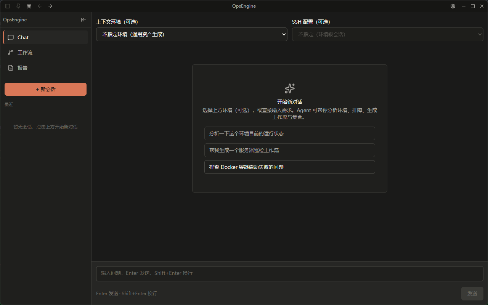
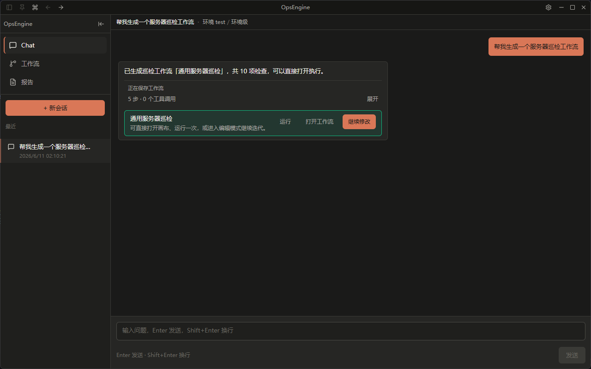
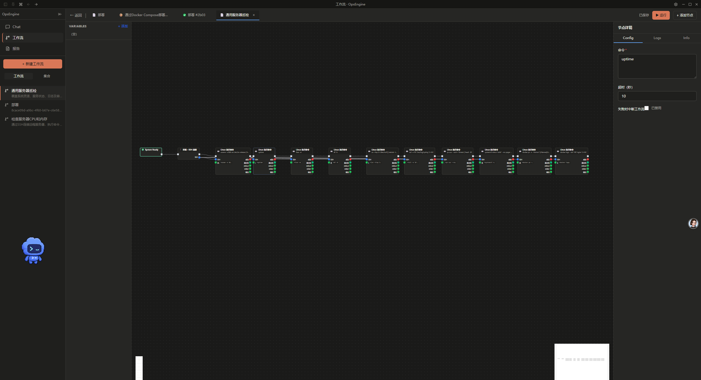
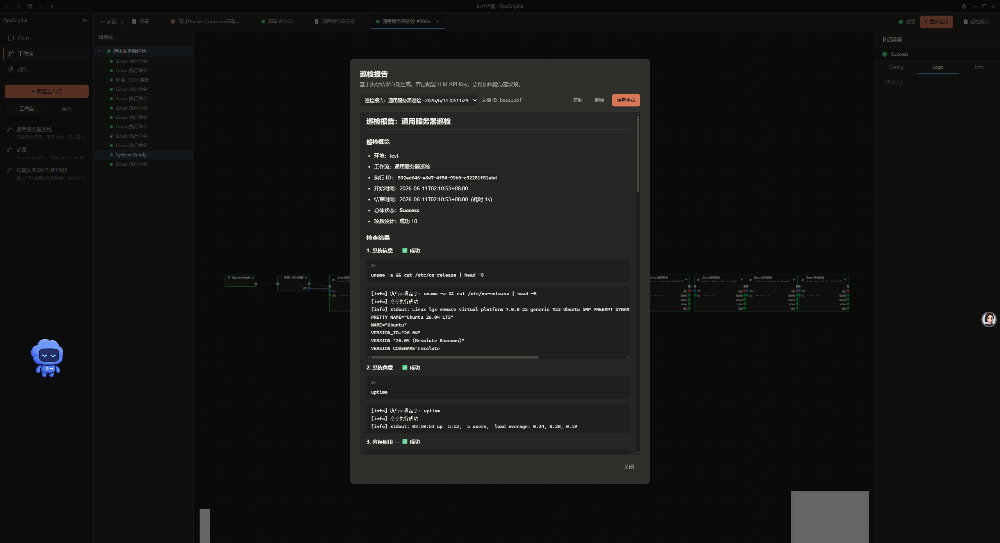

# OpsEngine

面向运维场景的可视化工作流桌面应用。通过节点图画出执行流与数据流，在本地运行并实时查看状态与日志；支持将子流程封装为可复用的**集合**（Assemble），在工作流或其它集合中调用。内置 **配置环境**、**AI 助手** 与 **运维报告**，帮助从对话、编排到执行与复盘形成闭环。

## 功能概览

- **  全新页面 **



- **  全新页面 **
自动生成工作流



## 技术栈

| 层级 | 技术 |
|------|------|
| 桌面壳 | [Wails v2](https://wails.io)（Go + WebView，无边框窗口 + 文件拖拽） |
| 后端 | Go 1.26、uber/zap、BurntSushi/toml |
| 执行引擎 | `internal/engine`（Exec/Data 双流、Frame 调用栈、Wails 事件） |
| AI Runtime | `internal/agent`（意图路由、工具循环、巡检/架构/工作流生成） |
| 客户端 | `internal/clients`（SSH、Docker、K8s、Jenkins、LLM） |
| 前端 | React 18、TypeScript、Vite、@xyflow/react、Tailwind CSS、Radix UI、TanStack Query |
| 通信 | Wails 方法绑定 + 运行时事件（无独立 HTTP 服务） |

## 环境要求

- **Go** 1.26+
- **Node.js** 18+ 与 npm
- **Wails CLI** v2

  ```bash
  go install github.com/wailsapp/wails/v2/cmd/wails@latest
  ```

- **Windows**：需安装 [WebView2 Runtime](https://developer.microsoft.com/microsoft-edge/webview2/)（Win10/11 通常已自带）
- **Linux / macOS**：按 [Wails 官方文档](https://wails.io/docs/gettingstarted/installation) 安装对应系统依赖

## 快速开始

```bash
git clone https://github.com/aidewn/OpsEngine.git
cd OpsEngine

# 开发模式（热重载：Go 后端 + 前端）
make dev
# 或
wails dev
```

首次启动会自动创建数据目录：

```
data/
├── workflows/      # 工作流定义（*.toml）
├── assembles/      # 集合定义（*.toml）
├── environments/   # 环境及连接配置（*.toml）
├── ai-sessions/    # AI 会话记录（*.toml）
├── docs/           # 运维报告 Markdown + 元数据
├── settings/       # 应用设置（如 ai.toml）
├── executions/     # 终态执行记录（*.toml，已在 .gitignore）
└── logs/           # 运行日志（已在 .gitignore）
```

### 构建发布版

```bash
make build
# 产物位于 build/bin/
```

### 运行测试

```bash
make test
# 或
go test ./...
```

引擎与 Agent 相关测试分别集中在 `internal/engine/` 与 `internal/agent/`。

## 使用说明

1. 启动应用后，在 **设置** 中配置 AI 连接（OpenAI 兼容 API）与 **配置环境**（SSH/Docker/K8s/Jenkins 凭证）。
2. 首页 **Chat** 标签：选择环境创建 AI 会话，可进行运维问答、排障、巡检、架构分析或生成工作流/集合。
3. **工作流** 标签 / 左侧栏：创建并打开工作流或集合，在画布上编辑节点与连线。
4. 在 **集合** 中维护可复用子图；保存后会在工作流画布的「添加节点」中作为 `assemble:<id>` 出现。
5. 运行工作流后，在 **执行** 详情页查看实时状态、调用栈与历史记录；可将执行结果生成巡检报告。
6. **报告** 标签：浏览 AI 对话或执行沉淀的 OpsDoc 文档。

### 端口与连线规则（摘要）

| 类型 | 约束 |
|------|------|
| `exec_out` | 单出（一条出边） |
| `exec_in` | 单入 |
| 数据 output | 多出 |
| 数据 input | 单入 |

保存工作流 / 集合时，后端会校验结构合法性；画布连接时支持拖到已有入边端口自动替换旧连接。

### 内置节点分类（摘要）

| 分类 | 代表节点 |
|------|----------|
| 系统事件 | `system_ready` / `system_update` / `system_over` |
| 集合 | `assemble_start` / `assemble_end` / `assemble_param` / `assemble:<id>` |
| 流程控制 | `parallel` / `thread` / `break` / `branch` / `for_loop` / `while_loop` |
| 变量与工具 | `varset` / `varget` / `print` / `to_string` / `text_template` / `regex_extract` |
| Linux SSH | `linux_exec_command` / `linux_file_*` / `linux_upload_file` / `ssh_with_linux` 等 |
| Docker | `docker_connect` / `docker_pull` / `docker_run` / `docker_build` / `docker_push` 等 |
| Kubernetes | `k8s_connect` / `k8s_find_workload` / `k8s_set_workload_image` |
| 环境连接 | `env_connect_ssh` / `env_connect_docker` / `env_connect_k8s` / `env_connect_jenkins` / `env_connect_localhost` |
| 环境探测 | `env_probe_ssh_*` / `env_probe_docker_*` / `env_probe_k8s_*` / `env_probe_jenkins_*` / `env_probe_localhost_*` |

完整节点列表见 [docs/introduction.md](docs/introduction.md)。

## 架构

```
┌─────────────────────────────────────────────────────────────┐
│  React 前端（frontend/src）                                  │
│  画布 · 执行监控 · AI 助手 · 环境配置 · Wails JS 绑定         │
└────────────────────────────┬────────────────────────────────┘
                             │ Bind + Events
┌────────────────────────────▼────────────────────────────────┐
│  main.go / app.go / ai.go / ops_doc.go（Wails 入口层）       │
└────────────────────────────┬────────────────────────────────┘
                             │
     ┌───────────────────────┼───────────────────────┐
     ▼                       ▼                       ▼
 internal/store        internal/engine          internal/nodes
 TOML 持久化            执行 / 调度 / 校验         内置节点注册
     │                       │
     │               internal/probe（编辑态探测）
     ▼
 internal/agent          internal/clients
 AI Runtime              SSH / Docker / K8s / Jenkins / LLM
```

**执行事件名**（前后端约定，见 `internal/engine/events.go`）：

- `execution:started` / `execution:status` / `execution:finished`
- `execution:node` / `execution:log` / `execution:variable`

**AI 助手事件名**（见 `ai.go` → `internal/agent/runtime`）：

- `ai:assistant`（流式文本、工作流/集合/文档产出、工具进度等）

事件 payload 可含 `framePath`，用于定位集合调用栈内的节点状态。

## 目录结构

```
OpsEngine/
├── main.go                 # Wails 应用入口
├── app.go                  # 工作流/集合/执行/环境/探测 API
├── ai.go                   # AI 设置、会话、助手入口
├── ops_doc.go              # 运维报告 CRUD 与巡检报告生成
├── Makefile
├── wails.json
├── docs/                   # 技术文档（见 docs/README.md）
├── data/                   # 本地数据（部分目录不入库）
├── frontend/               # React 前端
│   └── src/
│       ├── pages/          # 路由页面
│       ├── features/       # workflow / assemble / execution / ai / opsDocs
│       ├── api/            # Wails 调用封装
│       └── types/          # 与 Go 结构对齐的 TS 类型
└── internal/
    ├── core/               # 领域模型
    ├── engine/             # 执行引擎
    ├── nodes/              # 内置节点（init 注册）
    ├── store/              # TOML 存储
    ├── clients/            # 外部系统客户端
    ├── probe/              # 编辑态环境探测
    └── agent/              # AI Runtime（intent / runtime / tools / report）
```

## 开发指南

### 新增内置节点

1. 在 `internal/nodes/<name>/` 实现 `engine.Node`（`TypeDef` + `Execute`）。
2. 在包内 `init()` 中调用 `engine.Register`。
3. 在 `internal/nodes/nodes.go` 增加匿名 import，触发注册。

详见 [docs/node-development.md](docs/node-development.md)。

### 前后端协作

- **绑定方法**：`app.go` / `ai.go` / `ops_doc.go` 中 `App` 的 public 方法自动生成前端调用（`wails dev` 后出现在 `frontend/wailsjs/go/main/App`）。
- **类型**：Go 的 `json` tag 与 `frontend/src/types/` 保持一致（snake_case）。
- **集合节点类型**：运行时由 `GetNodeTypes()` 将每个 `AssembleDef` 转为 `assemble:<id>` 节点类型。

### 常用命令

| 命令 | 说明 |
|------|------|
| `make dev` | 开发模式 |
| `make build` | 构建桌面应用 |
| `make test` | 运行 Go 测试 |
| `make fmt` | `go fmt ./...` |
| `make tidy` | `go mod tidy` |

仅调试前端 UI 时（需已 `wails dev` 或自行处理绑定）：

```bash
cd frontend
npm install
npm run dev
```

## 文档

完整技术文档见 **[docs/](docs/README.md)**：

| 文档 | 内容 |
|------|------|
| [introduction.md](docs/introduction.md) | 项目完整介绍、概念与内置节点 |
| [architecture.md](docs/architecture.md) | 架构分层、执行/事件/Frame 调用分析 |
| [node-development.md](docs/node-development.md) | 新增内置节点开发手册 |
| [source-reading.md](docs/source-reading.md) | 源码阅读顺序与调试入口 |
| [environment-plan.md](docs/environment-plan.md) | 配置环境与环境探测节点（已实现） |
| [execution-ux-plan.md](docs/execution-ux-plan.md) | 执行列表/详情体验改进 |
| [agent-runtime-architecture-optimization.md](docs/agent-runtime-architecture-optimization.md) | AI Agent Runtime 架构 |
| [plugin-platform.md](docs/plugin-platform.md) | 插件平台规划（Lua 扩展节点） |
| [opsengine-long-term-development-tasks.md](docs/opsengine-long-term-development-tasks.md) | 长期演进路线图 |

## 路线图

核心 MVP（工作流引擎、集合、执行监控、Docker/K8s 节点、配置环境、AI 助手）已可用。后续重点包括：

- 插件平台与 Lua 扩展节点（见 [plugin-platform.md](docs/plugin-platform.md)）
- AI Runtime 持续演进：更稳定的两阶段工作流生成、安全策略、上下文预算（见 [opsengine-long-term-development-tasks.md](docs/opsengine-long-term-development-tasks.md)）
- 前端体验迭代（见 [frontend-redesign.md](docs/frontend-redesign.md)）

## 参与贡献

欢迎 Issue 与 Pull Request。提交前请：

1. 运行 `make test` 确保通过。
2. 遵循仓库内 `AGENTS.md` 的约定（注释使用中文、改动保持精简）。
3. 不提交 `data/executions`、`data/logs`、`data/ai-sessions` 等本地运行数据。

## 许可证

本项目采用 [MIT License](LICENSE) 开源。
