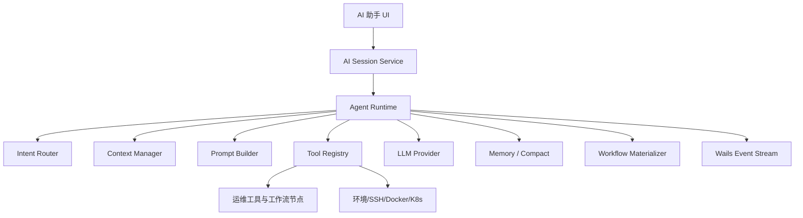

# OpsEngine Agent Runtime 架构优化方案

> 本文基于对 `oboard/claude-code-rev` 恢复版源码的架构阅读提炼，但不复制其实现代码。该仓库 README 已说明它是 source map 还原树，存在 shim 与降级实现，因此只能把它当作产品/工程模式参考，不能作为二开基底。

## 1. 结论

OpsEngine 不应该复刻通用代码助手，而应该建设一个面向运维场景的 Agent Runtime。当前项目已经具备 AI 会话、环境绑定、SSH 上下文预取、OpenAI 兼容 LLM、流式事件和工作流生成能力，下一步应把这些能力从 `ai.go` 拆成独立运行时层。

目标架构：



## 2. 从 Claude Code 架构中提炼的可借鉴模式

### 2.1 会话引擎与单轮执行解耦

其核心形态是：

- `QueryEngine` 管会话生命周期、可变消息、文件缓存、权限状态、总用量。
- `query` 管单轮模型调用、工具调用、上下文压缩、错误恢复。
- UI/SDK 通过流式事件消费运行过程。

OpsEngine 对应优化：

- `AISessionStore` 继续只负责持久化。
- 新增 `internal/agent/runtime`，负责一次用户输入的完整执行。
- `app.go/ai.go` 只做 Wails RPC 适配，不承载业务算法。

### 2.2 Prompt 拆成静态段与动态段

对方系统提示词不是一个大字符串，而是按 section 组合，并区分：

- 静态规则：角色、工具协议、安全边界、输出规范。
- 动态上下文：工作目录、可用工具、MCP 连接、用户配置、记忆。
- 追加提示：用户自定义 prompt、模式化 prompt。

OpsEngine 对应优化：

- 把硬编码 prompt 移到 `prompts/`。
- 每类运维任务有独立 prompt 模板与版本号。
- PromptBuilder 输出结构化 `[]ChatMessage`，不再在 `ai.go` 拼字符串。

建议目录：

```text
prompts/
  system/
    ops_assistant.md
    safety.md
  intent/
    router.md
  workflow/
    inspection_workflow.md
    troubleshooting_workflow.md
  report/
    inspection_report.md
```

### 2.3 上下文分层与预算

对方把上下文分为多类来源，并在压缩后重新注入关键附件：

- 会话消息
- 文件/工具结果
- memory
- skill/tool 目录
- MCP instructions
- compact summary

OpsEngine 也需要分层：

| 层级 | 内容 | 当前状态 | 优化 |
|---|---|---|---|
| System Context | 运维助手角色、安全规则 | 硬编码在 `ai.go` | 模板化 |
| Session Context | 用户/助手历史消息 | 已有 `AISession.Messages` | 增加摘要与裁剪 |
| Environment Context | 环境名、SSH/Docker/K8s 配置摘要 | 部分已有 | 不注入密钥，只注入资产摘要 |
| Server Snapshot | SSH 预取信息 | 已有 `ContextPrefetched` | 加时间戳、过期刷新、结构化采集 |
| Tool Catalog | 可用节点类型、端口、配置 schema | 工作流生成已用 | 统一由 ContextManager 产出 |
| Workflow Context | 已有工作流/集合 | 未系统化 | 生成/修改工作流时注入 |
| Memory Context | 用户偏好、常见巡检项、历史问题 | 暂无 | 新增会话摘要和长期偏好 |

### 2.4 工具调用需要权限、并发与进度协议

对方工具系统有几个关键点：

- 工具有 schema。
- 工具有并发安全判断。
- 读类工具可并发，写类/危险工具串行。
- 工具执行过程有 progress。
- 工具结果回写上下文。

OpsEngine 对应优化：

- 工作流节点可以作为 Agent Tool 暴露，但不要让模型直接执行危险动作。
- 第一阶段只开放只读工具：服务器快照、列目录、读日志、容器列表、K8s workload 列表。
- 写操作必须走“生成工作流草案 → 用户审查 → 用户执行”。

## 3. OpsEngine 当前架构问题

### 3.1 `ai.go` 过重

当前 `ai.go` 同时负责：

- 设置读取
- 会话 CRUD
- 意图判断
- LLM 调用
- SSH 预取
- prompt 构造
- 工作流 JSON 解析
- 工作流 materialize
- Wails 事件推送

这会导致后续新增“故障排查、巡检报告、架构解析、工作流修改”时继续堆叠。

### 3.2 Prompt 不可治理

目前 prompt 写在 Go 字符串里，不利于：

- 版本管理
- A/B 测试
- 按场景复用
- 输出 schema 演进
- 人工评审

### 3.3 上下文没有预算与压缩

当前 `buildChatLLMMessages` 会把会话历史直接转成 LLM messages。随着多轮对话增长，会遇到：

- token 失控
- 历史工具结果污染新问题
- 服务器快照过期但仍被当作事实
- 关键用户约束被淹没

### 3.4 意图判断太粗

当前关键词命中 “工作流 / 巡检 / 流程” 就走工作流生成。第一版可用，但后续会误判：

- “解释这个工作流为什么失败”
- “巡检报告怎么看”
- “不要生成工作流，只告诉我命令”

应拆成可替换的 Intent Router。

## 4. 推荐目标架构

### 4.1 后端模块拆分

```text
internal/agent/
  runtime/
    runtime.go          # 单轮执行入口
    events.go           # 统一事件协议
    turn.go             # Turn 状态与阶段
  intent/
    router.go           # 规则 + LLM intent 分类
  context/
    manager.go          # 收集、裁剪、排序上下文
    budget.go           # token/字符预算
    server_snapshot.go  # SSH 只读快照
  prompt/
    builder.go          # 模板加载与变量渲染
    templates.go        # 模板注册
  memory/
    compact.go          # 会话摘要
    store.go            # summary / preference 持久化
  tools/
    registry.go         # Agent 工具目录
    permissions.go      # 只读/写入/危险分级
  workflow/
    planner.go          # 调 LLM 生成工作流草案
    materializer.go     # 草案转 core.WorkflowDef
    validator.go        # 结构、安全、端口校验
```

`ai.go` 最终只保留：

- `GetAISettings/UpdateAISettings/TestAISettings`
- AI 会话 CRUD 的 Wails 方法
- `StartAIAssistant` 调用 `agent.Runtime.RunTurn`

### 4.2 统一事件协议

当前 `ai:assistant` 可以保留，但建议事件类型标准化：

```go
type AgentEvent struct {
    RequestID string `json:"request_id"`
    SessionID string `json:"session_id"`
    Type      string `json:"type"` // delta/progress/tool/workflow/report/done/error
    Phase     string `json:"phase,omitempty"`
    Text      string `json:"text,omitempty"`
    Payload   any    `json:"payload,omitempty"`
}
```

阶段建议：

- `intent`
- `context_collect`
- `llm_stream`
- `workflow_plan`
- `workflow_validate`
- `workflow_save`
- `report_generate`

### 4.3 Intent Router 两阶段

第一阶段：规则判断，低成本、可控。

```text
generate_workflow:
  同时命中：生成/创建/编排 + 工作流/流程/巡检

chat:
  默认
```

第二阶段：当规则不确定时才调用 LLM 分类，输出固定 JSON：

```json
{
  "intent": "chat | generate_workflow | troubleshoot | generate_report | analyze_architecture",
  "confidence": 0.82,
  "reason": "用户要求生成服务器巡检工作流"
}
```

### 4.4 Context Manager 输出结构

建议不要直接返回字符串，而是结构化上下文块：

```go
type ContextBlock struct {
    ID       string
    Kind     string // system/session_summary/server_snapshot/tool_catalog/environment/workflow
    Priority int
    TokenMax int
    Content  string
}
```

构造 prompt 时按优先级和预算裁剪。

优先级建议：

1. 用户当前输入
2. 安全规则
3. 目标环境摘要
4. 当前服务器快照
5. 工作流节点目录
6. 最近 N 轮会话
7. 会话摘要
8. 历史低价值消息

### 4.5 会话压缩策略

对方 compact prompt 的关键不是形式，而是“保留能继续工作的细节”。OpsEngine 可以做更垂直的摘要：

```text
summary:
  用户目标:
  已选择环境:
  服务器事实:
  已生成工作流:
  用户偏好:
  待办:
  错误和修复:
```

触发条件：

- 会话消息超过 20 条
- 估算字符数超过 30k
- 工作流生成完成后
- 用户切换环境时

### 4.6 工作流生成链路

推荐从“模型直接输出完整工作流”改成“两段式规划”：

1. LLM 输出运维计划，不含节点 ID。
2. 后端根据计划和节点目录 materialize 成 `WorkflowDef`。

这样比让模型直接拼节点/边更稳。

计划 JSON：

```json
{
  "name": "Linux 基础巡检",
  "goal": "采集 CPU、内存、磁盘、网络和日志",
  "steps": [
    {
      "kind": "ssh_script",
      "title": "采集系统状态",
      "script": "set +e\n..."
    }
  ],
  "report": {
    "enabled": true,
    "sections": ["概要", "风险项", "建议"]
  }
}
```

Materializer 决定：

- 节点类型
- 节点位置
- 连线
- 环境绑定
- 默认超时
- 安全校验

## 5. 分阶段落地计划

### M1：拆出 Agent Runtime 骨架

目标：不改变 UI 行为，只搬迁职责。

改动：

- 新增 `internal/agent/runtime`
- 新增 `internal/agent/intent`
- 新增 `internal/agent/prompt`
- `ai.go` 调 runtime

验收：

- AI 问答仍流式。
- 工作流生成仍可保存并跳转。
- `go test ./...` 通过。

### M2：Prompt 模板化

目标：所有硬编码 prompt 从 Go 代码迁到 `prompts/`。

改动：

- `prompts/system/ops_assistant.md`
- `prompts/workflow/inspection_workflow.md`
- `internal/agent/prompt.Builder`

验收：

- 修改 prompt 不需要改 Go 逻辑。
- 模板变量缺失时报清晰错误。

### M3：Context Manager 与预算

目标：控制上下文大小，避免历史污染。

改动：

- `ContextBlock`
- `ContextBudget`
- 会话历史裁剪
- server snapshot 过期策略

验收：

- 长会话不会无限增长。
- Prompt 中不出现 SSH 密码、私钥、Token。

### M4：会话摘要与记忆

目标：长会话可持续。

改动：

- `internal/agent/memory`
- `AISession.Summary`
- 摘要触发器

验收：

- 超过阈值后自动生成摘要。
- 新一轮对话带摘要但不带全部旧消息。

### M5：工作流计划器

目标：从“模型生成 WorkflowDef”改为“模型生成运维计划，后端 materialize”。

验收：

- 生成结果稳定。
- 不合法节点/端口不会进入工作流。
- 支持巡检、排障、报告三个计划类型。

## 6. 与当前代码的映射

| 当前文件 | 建议归属 |
|---|---|
| `ai.go` 设置 CRUD | 保留在 `main` |
| `ai.go` 会话 CRUD | 可保留在 `main` 或迁到 `internal/agent/session` |
| `resolveAIAssistantOperation` | `internal/agent/intent` |
| `buildChatLLMMessages` | `internal/agent/context` + `prompt` |
| `prefetchSSHContext` | `internal/agent/context/server_snapshot.go` |
| `buildWorkflowSystemPrompt` | `internal/agent/prompt` |
| `parseGeneratedWorkflow` | `internal/agent/workflow` |
| `materializeWorkflow` | `internal/agent/workflow` |
| `clients.LLMClient` | 保持在 `internal/clients` |
| `store.AISessionStore` | 保持在 `internal/store` |

## 7. 关键原则

1. 不基于恢复源码二开，只借鉴架构模式。
2. 运维 Agent 默认只读，变更动作通过工作流审查后执行。
3. 密钥永不进入 prompt。
4. prompt 是工程资产，需要模板、版本、测试。
5. 上下文必须有预算，不能无限拼接。
6. 工作流生成由后端 materialize，模型只做规划。
7. 每次 Agent turn 都要有可观测进度事件。

