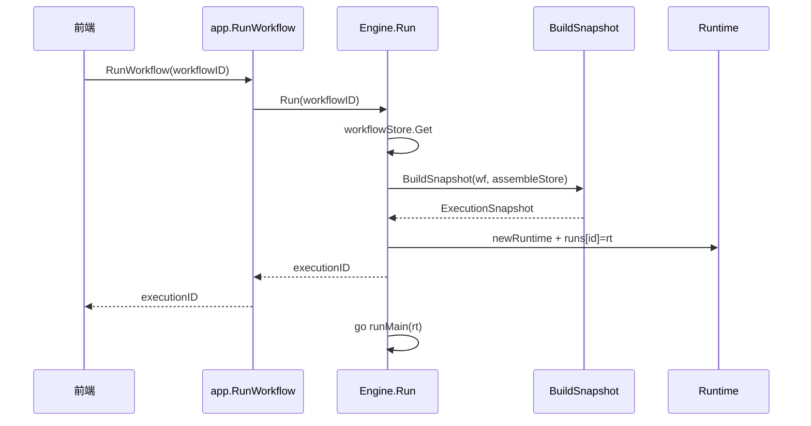

# 架构与调用分析手册

本文描述 OpsEngine 的分层结构、关键调用链与运行时行为，便于排查问题或扩展引擎。

## 1. 分层架构

```mermaid
flowchart TB
  subgraph Presentation["表现层 frontend/"]
    Pages[pages/*]
    Features[features/workflow|assemble|execution]
    API[api/* → wailsjs]
  end

  subgraph Application["应用层"]
    App[app.go]
  end

  subgraph Domain["领域层 internal/core"]
    Models[WorkflowDef / AssembleDef / ExecutionRecord]
  end

  subgraph Engine["引擎层 internal/engine"]
    Eng[Engine]
    RT[Runtime + Frame]
    Eval[evaluator / assemble / parallel / thread]
    Val[validate / snapshot]
  end

  subgraph Infrastructure["基础设施"]
    Store[internal/store TOML]
    Nodes[internal/nodes 插件式注册]
    Events[WailsEmitter]
  end

  Pages --> Features --> API --> App
  App --> Eng
  App --> Store
  Eng --> RT --> Eval
  Eng --> Val
  Eng --> Nodes
  RT --> Events
  Eng --> Store
  Models -.定义.-> App & Eng & Store
```

| 层 | 职责 | 不应包含 |
|----|------|----------|
| `frontend` | 画布编辑、执行 UI、事件 reducer | 执行语义、持久化格式 |
| `app.go` | Wails 绑定、集合→NodeType 转换、循环引用检查 | exec 流推进逻辑 |
| `internal/core` | 纯数据结构 | 副作用 |
| `internal/engine` | 执行、求值、校验、快照 | HTTP、文件路径硬编码 |
| `internal/nodes` | 单节点 `Execute` 实现 | 图遍历 |
| `internal/store` | TOML 读写 | 业务规则 |

## 2. 应用启动与 Wails 绑定

### 2.1 启动序列

```
main()
  └─ wails.Run(Bind: app)
       └─ app.startup(ctx)
            ├─ zap 日志
            ├─ mkdir data/{workflows,assembles,executions,logs}
            ├─ NewWorkflowStore / AssembleStore / ExecutionStore
            └─ engine.New(..., NewWailsEmitter(ctx))
```

`main.go` 通过 `_ "OpsEngine/internal/nodes"` 间接 import，触发所有内置节点 `init()` → `engine.Register`。

### 2.2 前端调用 Go 的路径

| 前端 | Go 方法 | 说明 |
|------|---------|------|
| `api/workflows.ts` | `ListWorkflows` / `GetWorkflow` / `CreateWorkflow` / `UpdateWorkflow` / `DeleteWorkflow` | 工作流 CRUD |
| `api/assembles.ts` | `ListAssembles` / … | 集合 CRUD |
| `api/executions.ts` | `RunWorkflow` / `StopWorkflow` / `ListExecutions` / … | 执行控制 |
| `api/nodeTypes.ts` | `GetNodeTypes` | 内置 + 动态 assemble 类型 |

`UpdateWorkflow` / `UpdateAssemble` 在写盘前调用 `engine.ValidateWorkflow` / `ValidateAssemble`；集合额外 `checkCircularRef`。

### 2.3 执行事件（Go → 前端）

定义于 `internal/engine/events.go`：

| 事件名 | 典型 payload 字段 | 前端处理 |
|--------|-------------------|----------|
| `execution:started` | `executionID`, `workflowID`, `snapshot`, `startedAt` | 创建 ExecutionState |
| `execution:status` | `executionID`, `status` | 更新整体状态 |
| `execution:node` | `executionID`, `framePath[]`, `nodeID`, `state`, `errorMsg?` | 按路径更新 Frame 内 nodeStates |
| `execution:log` | `executionID`, `framePath[]`, `nodeID`, `level`, `message` | 追加 nodeLogs |
| `execution:variable` | `executionID`, `framePath[]`, `name`, `value` | 更新 variables |
| `execution:finished` | `executionID`, `status`, `error?` | 收尾、刷新列表 |

`framePath` 为空表示 `RootFrame`；`["callNodeId"]` 表示 `RootFrame.Children["callNodeId"]`，可多级嵌套。

实现：`WailsEmitter.Emit` → `wailsruntime.EventsEmit`。

前端订阅：`frontend/src/features/execution/ExecutionStore.tsx` 中 `EventsOn(...)`。

## 3. 工作流执行主链路

### 3.1 从点击「运行」到 goroutine



### 3.2 runMain 生命周期

`internal/engine/engine.go` → `runMain`：

```
1. Emit execution:started + execution:status(Running)
2. scheduler.Start(ctx)     // 若有 system_update 且 enabled
3. executeFlow(readyID)     // system_ready 的 exec_out 后继
4. 等待策略：
   - 主流 error → cancel
   - 有 update 调度 → 阻塞到 ctx.Done()（用户 Stop）
   - 否则不阻塞（thread 由 wg 兜底）
5. scheduler.Stop(); rt.wg.Wait()
6. markRemainingTerminated()
7. runOver()                // 独立 30s ctx，不受主 cancel 影响
8. markSuccess/Failed/Terminated
9. executionStore.Save(Record)  // 若配置了 store
10. Emit execution:finished
```

### 3.3 executeFlow：Exec 流单线程推进

入口：`evaluator.go` → `executeFlow(ctx, frame, nodes, edges, startNodeID)`。

循环体对每个当前节点 `cur`：

```
┌─────────────────────────────────────────┐
│ 特判 assemble:<id>  → execAssembleCall  │
│ 特判 assemble_end   → runAssembleEnd → return │
│ 特判 parallel       → runParallel → next=exec_out_done │
│ 特判 thread         → runThread → next=exec_out_continue │
│ 特判 break          → cancel() → return │
│ 通用 Lookup(type)   → Execute → cache Outputs → next=exec_out │
└─────────────────────────────────────────┘
```

下一节点：`findNextExec(edges, cur, fromPort)`，匹配 `e.From.Node==cur && e.From.Port==fromPort`。

**取消**：`select ctx.Done()` 在循环开头检查；`break` 与 `Stop` 均通过 `rt.cancel()` 传播。

## 4. 数据流求值

与 Exec 流**解耦**：在节点 `Execute` 内调用 `ctx.Input(portID)` 时触发。

```
evalInput(node, port)
  └─ 找入边 → evalOutput(fromNode, fromPort)
       ├─ frame.Outputs[fromNode] 有缓存 → 直接返回（action 已执行）
       └─ 无缓存且 NodeKind==pure → Lookup.Execute → 取 output 端口值（不写入缓存）
```

要点：

- **Pure 节点**可能被多次求值（无缓存）。
- **Action 节点**的数据 output 必须先沿 exec 流执行过才有缓存。
- 集合调用的 param 在**父 frame** 上对调用节点实例求 `param_<name>` input。

## 5. Frame 调用栈模型

### 5.1 内存结构（引擎）

`internal/engine/runtime.go`：

```go
type Frame struct {
    AssembleID string              // "" = 主流
    Variables, Params, Returns map[string]any
    NodeStates map[string]NodeState
    NodeLogs   map[string][]LogEntry
    Outputs    map[string]Outputs  // instanceID → 端口输出
    Children   map[string]*Frame   // key = 调用方 instance ID
    Path       []string            // 事件用 framePath
    Parent     *Frame
}
```

`Runtime.rootFrame` 为栈底；`pushChildFrame` 在集合调用时创建子帧。

### 5.2 持久化 / API 结构（core）

`core.FrameState` 与 `Frame` 同形，用于 `ExecutionRecord.RootFrame` JSON 序列化给前端。

### 5.3 集合调用时序

```mermaid
sequenceDiagram
  participant Flow as executeFlow
  participant Call as execAssembleCall
  participant Child as child Frame
  participant End as assemble_end

  Flow->>Call: type assemble:uuid
  Call->>Call: evalInput params on parent
  Call->>Child: pushChildFrame
  Call->>Flow: executeFlow(assemble_start)
  Flow->>End: runAssembleEnd
  End->>Child: 写入 Returns
  Call->>Call: outputs return_* → parent Outputs[caller]
```

`assemble_end` 在非集合 frame 中会 `Skipped` 并打 warn 日志。

## 6. 流程控制特判

### 6.1 parallel

- `runParallel`：对每个 `exec_out_<n>`（非 `exec_out_done`）起 goroutine 跑 `executeFlow`。
- 分支共享**同一 parent Frame**（`frame.mu` / `Runtime.mu` 保护状态）。
- `WaitGroup` 等待全部分支；首个 error 记录；汇合后主流从 `exec_out_done` 继续。

节点包 `parallel` 的 `Execute` 可为空——逻辑在引擎。

### 6.2 thread

- `runThread`：`rt.wg.Add(1)` 后台跑 `exec_out_thread` 后继，不阻塞主流。
- 主流立即沿 `exec_out_continue` 前进。

### 6.3 system_update 调度器

`scheduler.go`：

- 读取 `system_update` 节点 `config`（`delta_type`: interval / manual / cron 预留）。
- `enabled`: off / on / auto（auto = 仅当 `exec_out` 有连线才启动 ticker）。
- 每次 tick 沿 `exec_out` 跑 update 流；`updateRunning` 防止重叠执行。

### 6.4 break 与 Stop

| 动作 | 机制 | 终态 |
|------|------|------|
| `break` 节点 | `rt.cancel()` | `Terminated` |
| `StopWorkflow` | `Engine.Stop` → `rt.cancel()` | `Terminated` |
| 主流节点 error | `markFailed` | `Failed` |

`markRemainingTerminated` 将仍为 `Executing` 的节点标为 `Terminated`。

## 7. 快照与持久化

### 7.1 BuildSnapshot

`engine/snapshot.go`：从工作流节点中的 `assemble:*` 引用 DFS 加载所有集合到 `ExecutionSnapshot.Assembles`。

运行期**只读** snapshot，保证执行确定性。

### 7.2 Store

| Store | 文件 | 操作 |
|-------|------|------|
| `WorkflowStore` | `data/workflows/<id>.toml` | List/Get/Save/Delete |
| `AssembleStore` | `data/assembles/<id>.toml` | 同上 |
| `ExecutionStore` | `data/executions/<id>.toml` | 终态 Save；List/Get/Delete |

`Engine` 内存 `runs map[id]*Runtime` 保留进行中与刚结束的记录；`ListSummaries` 合并内存与磁盘。

## 8. 校验链

保存工作流/集合时：

```
ValidateWorkflow / ValidateAssemble
  ├─ validateSingletons（system_* / assemble_* 至多 1 个）
  ├─ validateExecOutSingle（from 端口 id 以 exec_ 开头）
  └─ validateInputSingle（每个 to 端口至多 1 入边）
```

应用层 `UpdateAssemble` 额外 `checkCircularRef`（DFS）。

前端 `WorkflowCanvas` / `isValidConnection` 在连线时做同类约束，并支持 input 端口**替换旧连接**。

## 9. 前端架构要点

| 模块 | 职责 |
|------|------|
| `WorkflowCanvas` / `AssembleCanvas` | React Flow，`canvasMapping` ↔ `WorkflowDef` |
| `ExecutionStore` | 全局执行态 + Wails 事件 reducer |
| `useNodeExecState` | 按 `framePath` 取节点着色状态 |
| `nodeTypeMap` | 特殊节点 UI；其余走 `GenericNode` |
| `ConfigForm` | 按 `ConfigSchema` 渲染配置（迭代中） |

画布保存：防抖 `UpdateWorkflow` / `UpdateAssemble` 整体 PUT 定义（非增量 patch）。

## 10. 扩展点一览

| 扩展点 | 位置 | 说明 |
|--------|------|------|
| 新内置节点 | `internal/nodes/<pkg>` + `nodes.go` import | 实现 `engine.Node` |
| 新集合能力 | 仅数据 + 图 | 自动出现在 `GetNodeTypes` |
| 引擎特判新流控 | `evaluator.executeFlow` | 需改引擎，慎用 |
| 新端口类型 | `core.PortType` + 前端连接校验 | 类型兼容规则 |
| 事件字段 | `events.go` + `ExecutionStore` | 前后端同步改 |

## 11. 相关文档

- [项目完整介绍](./introduction.md)
- [节点开发手册](./node-development.md)
- [源码阅读说明](./source-reading.md)
