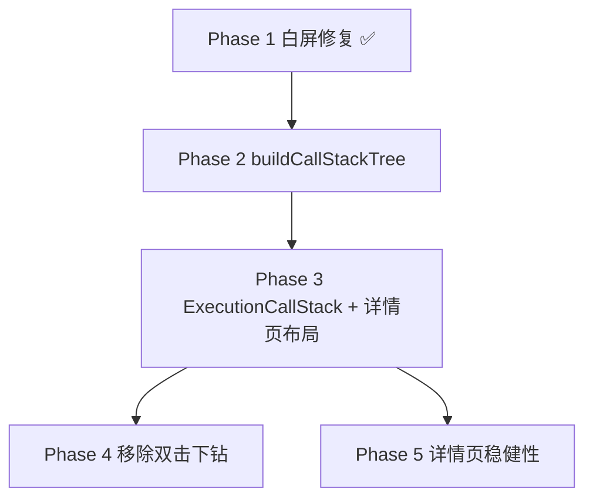

# 执行体验改进计划

> 首页执行列表白屏修复 + 执行详情页调用栈侧栏 + 详情页稳健性。  
> 与 [architecture.md](./architecture.md) 中 Frame 树、Wails 事件流章节配合阅读。

---

## 0. 总览

| 阶段 | 主题 | 状态 |
|------|------|------|
| Phase 1 | 首页「执行」tab 白屏修复 | **已完成** |
| Phase 2 | 调用栈树数据层（`buildCallStackTree`） | **已完成** |
| Phase 3 | 调用栈侧栏 UI + 接入执行详情页 | **已完成** |
| Phase 4 | 移除双击下钻集合 | **已完成** |
| Phase 5 | 执行详情页稳健性（record 兜底、404 跳转） | **已完成** |

**Agent 分批建议：**

| 批次 | 内容 |
|------|------|
| Agent 1 | Phase 1（已完成） |
| Agent 2 | Phase 2 + Phase 3 |
| Agent 3 | Phase 4 + Phase 5 + 可选 polish |

---

## 1. Phase 1：首页「执行」tab 白屏（已完成）

### 1.1 现象

点击首页「执行」tab 后整窗白屏；DevTools 报错：

```
Uncaught TypeError: Cannot read properties of null (reading 'length')
  at ExecutionList.tsx
```

### 1.2 根因

```
Go ListSummaries() 无记录 → 返回 nil slice
    → Wails/JSON 序列化为 null（不是 []）
    → 前端 const { data: execs = [] } 对 null 不生效
    → execs.length 崩溃 → React 整树卸载 → 白屏
```

### 1.3 已做改动

| 文件 | 改动 |
|------|------|
| `internal/engine/engine.go` | `ListSummaries` 使用 `make([]ExecutionSummary, 0)`，避免 nil slice |
| `frontend/src/api/executions.ts` | `normalizeExecutionList()` / `normalizeExecutionListByWorkflow()`：`null` → `[]` |
| `frontend/src/features/execution/ExecutionList.tsx` | `Array.isArray(data) ? data : []`；错误态；空态引导 |
| `frontend/src/features/execution/RunningBadge.tsx` | 同样防御 `null` |

### 1.4 验收

- [x] 0 条记录：显示 tab + 标题 + 空态卡片，不白屏
- [x] `npm run build` 通过
- [ ] 手动：`wails dev` 下切换执行 tab、删除最后一条记录后仍正常

---

## 2. 背景：Frame 树与调用栈侧栏

### 2.1 后端数据模型（已有）

执行记录 `ExecutionRecord.root_frame` 是递归树：

```
root_frame                         ← framePath = []
├── node_states / node_logs        ← 主流节点
└── children["call"]               ← framePath = ["call"]
    ├── assemble_id = "asm-1"
    ├── node_states["print"]       ← 集合内部节点
    └── children[...]              ← 嵌套集合继续嵌套
```

- **主流画布**只能看到 `assemble:<id>` 调用节点变绿。
- **集合内部**节点状态/日志在 `children[callerInstanceID]` 子 frame 中。
- 引擎事件（`execution:node` / `execution:log`）payload 带 `framePath`，`ExecutionStore` 已按 path 更新。

### 2.2 调用栈侧栏做什么

侧栏 = 把 `root_frame` 树可视化，让用户切换「当前查看哪一层执行」：

| 用户操作 | 背后逻辑 |
|----------|----------|
| 显示树 | 递归读 `root_frame` + `children` |
| 点击某一层 | 设置 `framePath`（与现有面包屑相同） |
| 画布切换 | `[]` → 工作流图；`["call"]` → 对应集合图 |
| 节点状态/日志 | `useNodeExecState` + `NodeDetailPanel` 用同一 `framePath` |
| 实时更新 | Wails 事件 → `ExecutionStore` → 侧栏状态刷新 |

**不负责：** 重新执行、修改工作流结构、在主流画布内联嵌套集合图。

### 2.3 与现有下钻方式的关系

| 能力 | 现状 | 目标 |
|------|------|------|
| 进入集合 frame | 双击 `assemble:<id>` 节点（难发现，有 selectedNodeId 竞态） | **调用栈侧栏** |
| 路径指示 | 下钻后才显示面包屑 | 侧栏常驻 + 面包屑同步 |
| 看内部节点 | 必须先下钻 | 侧栏展开可见节点摘要 |

---

## 3. Phase 2：调用栈树数据层

### 3.1 新建文件

`frontend/src/features/execution/buildCallStackTree.ts`

### 3.2 类型定义

```ts
interface CallStackNode {
  framePath: string[];       // 定位 frame，[] = 主流
  label: string;             // 显示名
  kind: 'root' | 'assemble';
  callerNodeId?: string;     // 父图上的调用节点 instance_id
  assembleId?: string;
  status?: WorkflowStatus;   // frame 级汇总
  children: CallStackNode[];
  nodeEntries?: {
    nodeId: string;
    state: NodeState;
    label: string;
  }[];
}
```

### 3.3 构建规则

**输入：**

- `exec.rootFrame: FrameState`
- `exec.snapshot: ExecutionSnapshot`（workflow 名、assemble 名、节点 type_id）

**label 规则：**

| 节点 kind | label 示例 |
|-----------|------------|
| `root` | `{workflowName}` |
| `assemble` | `📦 {assembleName}`（可选后缀 `via {callerDisplayName}`） |

**frame 状态汇总（`status`）：**

1. 任一节点 `Failed` / `CheckFailed` → `Failed`
2. 任一节点 `Executing` → `Running`
3. 全部 `Success` / `Skipped` → `Success`
4. 有 `Terminated` 且无 Failed → `Terminated`
5. 无状态 → 不填或 `Idle`

**`nodeEntries`（可选 P1）：**

- 遍历该 frame 的 `node_states`
- `label` 从 snapshot 中节点 `type_id` → `NodeTypeDef.display_name`（或 instance_id 兜底）

### 3.4 纯函数签名

```ts
export function buildCallStackTree(
  rootFrame: FrameState,
  snapshot: ExecutionSnapshot,
  nodeTypeNames?: Map<string, string>,
): CallStackNode;
```

### 3.5 测试

新建 `frontend/src/features/execution/buildCallStackTree.test.ts`：

- mock 2 层嵌套 `FrameState`（主流 + 1 个 assemble child）
- 断言树深度、label、framePath、status 汇总

### 3.6 验收

- [ ] 单元测试通过
- [ ] 空 `children` 时不报错，仅根节点

---

## 4. Phase 3：调用栈侧栏 UI + 接入详情页

### 4.1 新建组件

`frontend/src/features/execution/ExecutionCallStack.tsx`

**Props：**

```ts
interface Props {
  exec: ExecutionState;
  framePath: string[];
  selectedNodeId: string | null;
  onSelectFrame: (path: string[]) => void;
  onSelectNode: (nodeId: string | null) => void;
}
```

**UI 行为：**

1. 宽约 240–280px，左侧固定，内容可滚动
2. 树形列表，默认展开所有 frame
3. 当前 `framePath` 对应行高亮
4. 点击 frame 行 → `onSelectFrame(path)`，建议同时 `onSelectNode(null)`
5. （P1）展开 frame 显示 `nodeEntries`，点击 → `onSelectNode` + 确保 frame 已选中
6. 行首复用 `WorkflowStatusIcon` / `NodeStatusIcon`

### 4.2 修改执行详情页布局

**文件：** `frontend/src/pages/ExecutionDetailPage.tsx`

目标布局：

```
┌──────────────────────────────────────────────────────────┐
│ Header + TabBar + 状态 + 停止/重跑                         │
├───────────┬─────────────────────────────┬────────────────┤
│ CallStack │ WorkflowCanvas (readOnly)   │ NodeDetailPanel│
│ 侧栏      │                             │                │
└───────────┴─────────────────────────────┴────────────────┘
```

**接入要点：**

- 已有 `framePath` / `setFramePath` 传给侧栏
- 切换 frame 时清空 `selectedNodeId`（已有 `useEffect`）
- 顶部面包屑保留，与侧栏高亮同步

### 4.3 可选：ErrorBoundary

**文件：** 新建 `frontend/src/components/ErrorBoundary.tsx`  
包住侧栏 + 画布，避免单组件 crash 导致整页白屏。

### 4.4 验收

- [ ] 主流：画布 = 工作流，侧栏高亮根
- [ ] 点击集合 frame：画布切到 assemble 图；内部 print/end 状态正确
- [ ] 运行中：侧栏随 Wails 事件更新
- [ ] 历史记录：刷新页面 / `GetExecution` hydrate 后树完整
- [ ] 嵌套集合（集合内再调集合）：树多层展开正确

---

## 5. Phase 4：移除双击下钻

### 5.1 改动

**文件：** `frontend/src/pages/ExecutionDetailPage.tsx`

- 删除或置空 `handleNodeDoubleClick` 中的 assemble 下钻逻辑
- 执行页只读，`onNodeDoubleClick` 可不传或 no-op
- （工作流**编辑**页若需双击跳转集合编辑，保留在 `WorkflowCanvasPage`，勿影响）

### 5.2 可选视觉提示（P1）

**文件：** `frontend/src/features/workflow/nodes/GenericNode.tsx` 或 execution 专用 wrapper

- 若 `exec.rootFrame.children[nodeId]` 存在 → 角标「有子执行」
- 提示用户通过侧栏查看

### 5.3 验收

- [ ] 双击 `assemble:<id>` 节点不会切换 frame
- [ ] 侧栏是进入子 frame 的主入口

---

## 6. Phase 5：执行详情页稳健性

### 6.1 record 兜底（避免 hydrate 竞态白屏）

**问题：** 详情页 `if (!exec) return 执行记录不存在`，但 `record` 已从 API 返回、`hydrate` 尚未执行时会误报。

**方案：**

```ts
// ExecutionStore 或 ExecutionDetailPage 内
function recordToState(record: ExecutionRecord): ExecutionState { ... }

const displayExec = exec ?? (record ? recordToState(record) : null);
```

后续逻辑统一用 `displayExec`。

### 6.2 404 / 记录不存在

- `GetExecution` 失败或 `displayExec` 为空 → 提示 + `navigate('/')`（或带 query 打开执行 tab）
- 删除记录后若仍停留在旧 URL，自动跳回

### 6.3 ErrorBoundary

- 详情页主内容区包裹 ErrorBoundary
- 首页 tab 内容区也可包裹（与 Phase 3 共用组件）

### 6.4 验收

- [ ] 打开详情页无 exec store 缓存时，首屏不闪「不存在」
- [ ] 访问已删除 execution ID 有明确提示并回首页
- [ ] 组件 throw 时显示错误 UI 而非白屏

---

## 7. 依赖与顺序



Phase 4、5 可与 Phase 3 末尾并行，但 Phase 2 必须先于 Phase 3。

---

## 8. 不在本次范围

- 侧栏拖拽调宽、搜索/filter
- 主流画布内联预览集合执行
- 执行列表分页、批量清理策略
- 调用栈导出 / 与日志面板联动过滤

---

## 9. 关键文件索引

| 用途 | 路径 |
|------|------|
| 执行列表 | `frontend/src/features/execution/ExecutionList.tsx` |
| 执行 API | `frontend/src/api/executions.ts` |
| 执行 Store | `frontend/src/features/execution/ExecutionStore.tsx` |
| 执行详情页 | `frontend/src/pages/ExecutionDetailPage.tsx` |
| 节点执行状态 hook | `frontend/src/features/workflow/nodes/useNodeExecState.ts` |
| Frame 类型 | `frontend/src/types/execution.ts` |
| 后端 ListSummaries | `internal/engine/engine.go` |
| 后端 Frame 序列化 | `internal/engine/runtime.go` → `serializeFrame` |
| 后端 Record 结构 | `internal/core/execution.go` |

---

## 10. 文档维护

- Phase 2–5 完成后，在本表「状态」列标记 **已完成**，并补充实际文件名差异。
- 若实现与本文冲突，以源码为准并回写本文。
