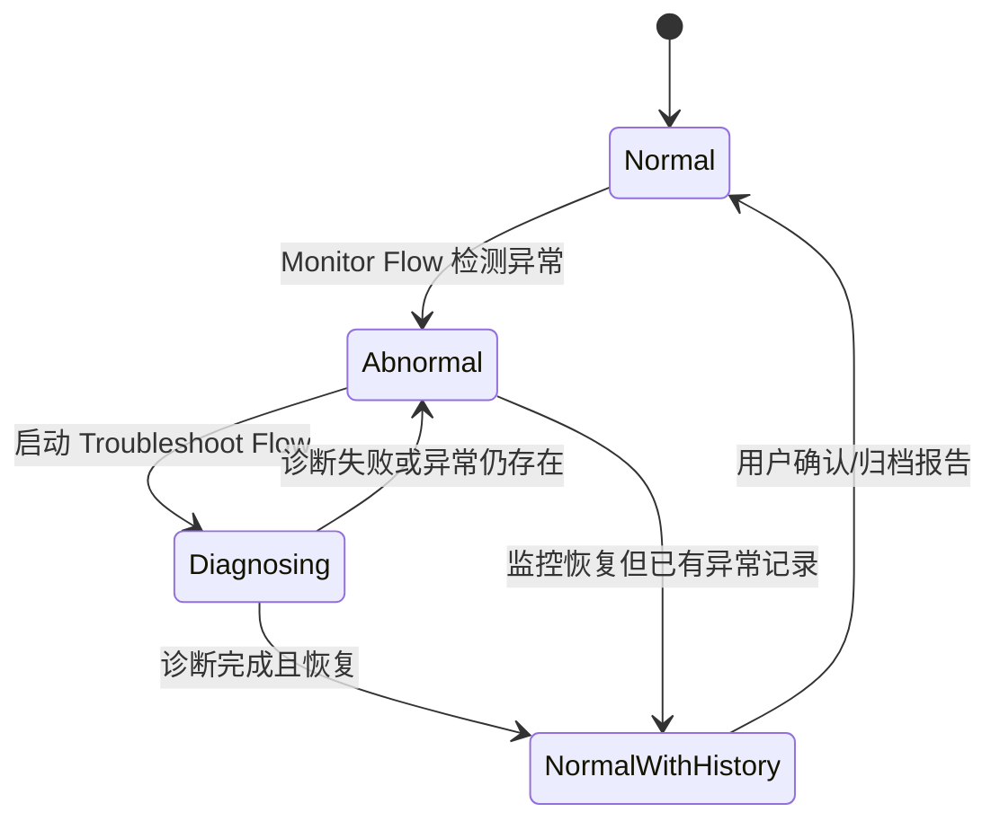

# OpsEngine 轻量监控体系改造方案

本文整理监控能力讨论结论，用于指导后续设计与拆分实现。目标不是复制完整的 Grafana、Prometheus 或企业级监控平台，而是在 OpsEngine 现有“环境 + 工作流 + AI + 报告”基础上，补齐个人/小团队场景下的关键指标监控、异常诊断和报告闭环。

## 1. 产品定位

OpsEngine 监控体系的定位是：

> 选择环境后，按分组管理关键监控项；新数据到来后立即判断，正常数据不保存，异常时创建事件、自动或手动诊断，并沉淀诊断报告。

它更像“关键项守望 + 异常自动诊断”，而不是长期指标数据库。

当前阶段不做：

- 不做完整时序数据库。
- 不保存所有历史采集点。
- 不内置向量数据库作为必需能力。
- 不替代企业已有监控体系。
- 不让每个监控项直接、重复访问服务器。

优先做：

- 环境级监控入口。
- 分组级监控管理。
- 监控项状态概览。
- 可定义采集项。
- 批量采集与即时判断。
- 异常事件与诊断报告。
- 从概览页直接跳转到具体监控项、异常事件或报告。

## 2. 信息架构

监控入口采用“环境 -> 分组 -> 监控项”的管理路径。

```text
监控首页
  -> 环境列表 / 环境切换
      -> 监控概览
      -> 分组列表
          -> 监控项列表
              -> 监控项详情
                  -> 监控流程
                  -> 排查流程
                  -> 异常历史
                  -> 报告
```

### 2.1 环境级管理

用户进入监控能力时，先选择环境。

环境来自现有 `Environment` 能力，一个环境可以包含 SSH、Docker、K8s、Jenkins 等配置。监控只在当前环境范围内组织，不跨环境混合展示，避免目标边界不清。

环境级页面需要提供：

- 当前环境健康概览。
- 当前有问题的监控项数量。
- 诊断中的监控项数量。
- 有异常历史但当前已恢复的监控项数量。
- 分组入口。
- 最近异常与报告入口。

### 2.2 分组级管理

分组用于把同一环境下的监控项按业务、主机、服务或职责归类。

示例：

```text
生产环境
  -> Web 服务
  -> 数据库
  -> 基础资源
  -> 容器运行时
  -> 发布链路
```

分组本身不直接采集数据，只负责组织监控项和展示聚合状态。

### 2.3 监控项

监控项是最小监控单元。它对应一个用户关心的问题，而不是一条原始指标。

示例：

```text
CPU 使用率是否大于 80%
磁盘水位是否大于 85%
nginx 容器是否正在运行
K8s deployment 是否存在不可用副本
HTTP 健康检查是否失败
```

每个监控项包含两个运行策略：

```text
Monitor Flow
  高频、轻量、只做判断。

Troubleshoot Flow
  低频、按需、深入排查并生成报告。
```

Panel 可以作为监控项的可视化形态，但它不再是 Grafana 式查询面板，而是一个“工作流面板”。

## 3. 监控首页与概览页

监控首页需要先回答一个问题：

> 当前哪些监控项有问题，我应该先看哪里？

因此首页不应只是环境列表，而要提供跨环境或当前环境的异常入口。

### 3.1 首页展示

首页建议包含：

- 环境切换器。
- 当前环境状态摘要。
- 有问题监控项列表。
- 诊断中监控项列表。
- 已恢复但有异常历史的监控项列表。
- 最近生成的诊断报告。

每一项都支持直接跳转：

```text
有异常 -> 跳转到监控项详情 / 当前 Incident
诊断中 -> 跳转到诊断进度
正常（有异常历史） -> 跳转到最近报告
```

### 3.2 概览状态

监控项的主状态建议先收敛为四类：

| 展示状态 | 含义 | 用户动作 |
| --- | --- | --- |
| 正常 | 当前没有异常，且无未处理异常历史 | 可查看详情 |
| 有异常 | 当前已发现异常，尚未完成诊断报告 | 可进入详情或启动诊断 |
| 诊断中 | 异常已触发排查流程，正在生成诊断结果 | 查看诊断进度 |
| 正常（有异常历史） | 当前已恢复，但存在最近异常报告 | 查看报告 |

示例展示：

```text
CPU 使用率是否大于 80%        正常
CPU 使用率是否大于 80%        有异常                  报告
CPU 使用率是否大于 80%        异常                    诊断中
CPU 使用率是否大于 80%        正常（有异常历史）      报告
```

其中“报告”不是每次正常采集都生成，而是异常事件进入诊断或结束后生成。

## 4. 数据采集策略

### 4.1 不按监控项逐个采集

错误方式：

```text
监控项 A -> SSH 服务器
监控项 B -> SSH 服务器
监控项 C -> SSH 服务器
```

正确方式：

```text
当前环境全部启用监控项
  -> 汇总数据需求
  -> 按目标和数据类型去重
  -> 批量采集
  -> 分发给监控项判断
```

这能避免监控项数量增加后把服务器、SSH 连接、Docker API 或 K8s API 打爆。

### 4.2 OpsEngine 内置 DataSource

OpsEngine 需要内置一个轻量 DataSource，用于定义当前环境要采集哪些数据。

DataSource 不负责长期保存数据，只负责：

- 描述可采集数据。
- 合并采集需求。
- 执行一轮采集。
- 把采集结果传给监控项。

第一阶段建议支持：

| 数据类型 | 示例 |
| --- | --- |
| `host.basic` | CPU、内存、负载、运行时间 |
| `host.disk` | 磁盘使用率、挂载点 |
| `docker.containers` | 容器列表、状态、重启次数 |
| `k8s.workloads` | deployment、pod、可用副本 |
| `http.health` | URL 状态码、响应时间 |
| `log.tail_summary` | 最近日志错误摘要 |

### 4.3 一轮监控 Tick

一轮监控执行分为三步：

```text
Plan
  收集当前环境下所有启用监控项的数据需求。

Collect
  按目标、协议、数据类型合并采集。

Evaluate
  每个监控项拿到本轮数据切片，运行 Monitor Flow。
```

伪流程：

```text
MonitorScheduler.Tick(environmentID)
  groups = ListEnabledGroups(environmentID)
  panels = ListEnabledPanels(groups)
  requirements = ExtractRequirements(panels)
  plan = BuildCollectionPlan(requirements)
  batch = ExecuteCollectionPlan(plan)

  for panel in panels:
      input = SliceBatch(batch, panel.requirements)
      result = RunMonitorFlow(panel, input)
      UpdatePanelState(panel, result)
```

## 5. 数据存储策略

当前阶段不引入完整 MetricStore，也不引入内置向量数据库。

### 5.1 正常数据不保存

监控数据的默认生命周期是：

```text
采集 -> 判断 -> 无异常 -> 丢弃
```

这适合个人使用场景，也符合“只监控关键指标”的产品定位。

例如用户只关心磁盘水位是否超过 85%，那么系统不需要保存过去所有磁盘水位，只需要在本轮判断是否异常。

### 5.2 只保存状态、异常和报告

需要持久化的是：

- 当前监控项状态。
- 当前异常事件。
- 异常发生时的关键证据。
- 诊断过程。
- 诊断报告。
- 异常恢复后的历史标记。

建议存储：

```text
PanelState
  当前状态、最近判断时间、当前 Incident、最近报告。

Incident
  异常事件、触发值、证据、诊断状态。

MonitorReport
  AI 或排查流程生成的诊断报告。
```

### 5.3 短暂内存态

为了支持“连续 N 次异常”或“恢复判断”，可以保留少量内存态。

示例：

```text
最近 3 次判断结果
最近一次采集值
当前异常连续次数
当前恢复连续次数
```

这类数据可以先只放内存，必要时再跟随 PanelState 持久化。

## 6. Monitor Flow 与 Troubleshoot Flow

### 6.1 Monitor Flow

Monitor Flow 是监控项的高频判断流程。

边界：

- 只处理本轮 DataSource 采集结果。
- 不直接访问服务器。
- 不调用 AI。
- 不做高成本排查。
- 输出结构化状态。

示例：

```text
datasource_read(host.basic)
  -> field(cpu_usage)
  -> threshold(> 80)
  -> panel_status(normal / abnormal)
```

输出：

```json
{
  "status": "abnormal",
  "severity": "warning",
  "summary": "CPU 使用率超过 80%",
  "evidence": [
    "当前 CPU 使用率 91.2%"
  ],
  "should_troubleshoot": true
}
```

### 6.2 Troubleshoot Flow

Troubleshoot Flow 是异常后的低频排查流程。

触发方式：

- 用户手动点击诊断。
- 监控项首次异常。
- 异常连续 N 次。
- 严重级别升级。

它可以：

- 读取异常触发证据。
- 访问真实环境。
- 调用 SSH、Docker、K8s、日志节点。
- 调用 AI 生成诊断结论。
- 生成 MonitorReport。

输出：

```json
{
  "probable_cause": "CPU 被 nginx worker 持续占用",
  "confidence": 0.74,
  "evidence": [
    "top 显示 nginx worker 占用 CPU 最高",
    "访问日志 QPS 同期升高"
  ],
  "recommended_actions": [
    "确认流量是否为预期峰值",
    "检查 nginx 访问日志中的异常来源",
    "必要时扩容或限流"
  ]
}
```

## 7. 状态机

监控项状态机建议如下：



状态含义：

| 状态 | 含义 |
| --- | --- |
| `Normal` | 当前正常，无需用户处理 |
| `Abnormal` | 当前异常，已有 Incident |
| `Diagnosing` | 排查流程正在执行 |
| `NormalWithHistory` | 当前正常，但最近有异常报告未归档 |

## 8. 建议数据模型

### 8.1 MonitorGroup

```go
type MonitorGroup struct {
    ID            string
    EnvironmentID string
    Name          string
    Description   string
    Order         int
    Enabled       bool
    CreatedAt     time.Time
    UpdatedAt     time.Time
}
```

### 8.2 MonitorPanel

```go
type MonitorPanel struct {
    ID                 string
    EnvironmentID      string
    GroupID            string
    Name               string
    Description        string
    Enabled            bool
    Requirements       []DataRequirement
    MonitorFlow        PanelFlow
    TroubleshootFlow   PanelFlow
    TriggerPolicy      TriggerPolicy
    CreatedAt          time.Time
    UpdatedAt          time.Time
}
```

### 8.3 DataRequirement

```go
type DataRequirement struct {
    TargetID string
    Kind     string
    Params   map[string]any
}
```

示例：

```json
{
  "target_id": "web-01",
  "kind": "host.disk",
  "params": {
    "mount": "/"
  }
}
```

### 8.4 PanelState

```go
type PanelState struct {
    PanelID          string
    Status           string
    Severity         string
    Summary          string
    LastCheckedAt    time.Time
    CurrentIncidentID string
    LastReportID     string
    HasHistory       bool
}
```

### 8.5 Incident

```go
type Incident struct {
    ID            string
    EnvironmentID string
    GroupID       string
    PanelID       string
    Status        string
    Severity      string
    Title         string
    Evidence      []string
    TriggerValue  map[string]any
    StartedAt     time.Time
    ResolvedAt    *time.Time
    ReportID      string
}
```

### 8.6 MonitorReport

```go
type MonitorReport struct {
    ID          string
    IncidentID  string
    PanelID     string
    Title       string
    Content     string
    CreatedAt   time.Time
    UpdatedAt   time.Time
}
```

## 9. RAG 与向量数据库结论

当前阶段不内置向量数据库。

原因：

- 当前监控不保存高频历史指标。
- 异常数量在个人使用场景下不会一开始就很大。
- 报告全文检索和列表筛选已能满足第一阶段使用。
- 内置向量数据库会增加安装、索引、清理和重建复杂度。

后续如果 MonitorReport、OpsDoc、AI 会话、历史故障积累到一定规模，再考虑增加可选的知识检索能力。

未来 RAG 的合理范围是：

```text
输入：历史报告、OpsDoc、排查结论、架构说明
用途：召回相似故障和历史修复方案
不用于：保存每一轮 CPU、磁盘、内存、容器状态
```

## 10. 与现有系统关系

### 10.1 与 Environment 的关系

监控必须依赖环境。

用户路径：

```text
选择环境 -> 选择分组 -> 查看监控项
```

监控项的数据需求必须限制在当前环境内，后端执行时通过 `environment_id` 和环境内的配置引用真实凭证。

### 10.2 与 Workflow 的关系

现有普通工作流继续用于：

- 一次性运维任务。
- 巡检。
- 发布。
- 修复。
- 手动编排。

监控新增 Panel Flow：

- `monitor`：轻量判断。
- `troubleshoot`：异常排查。

Panel Flow 可以复用节点系统，但不使用 `system_ready / system_update / system_over` 三周期模型。

### 10.3 与 AI 的关系

AI 不参与每轮监控判断。

AI 只在以下场景进入：

- 用户手动诊断。
- 异常触发排查流程。
- 生成诊断报告。
- 总结异常原因和修复建议。

### 10.4 与 OpsDoc 的关系

MonitorReport 后续可以与 OpsDoc 打通。

第一阶段可以先独立保存报告；当报告体系稳定后，再统一为 OpsDoc 的一种来源或一种文档类型。

## 11. 前端页面建议

### 11.1 路由

建议新增：

| 路由 | 说明 |
| --- | --- |
| `/monitor` | 监控首页，展示环境切换与异常概览 |
| `/monitor/environments/:environmentID` | 环境监控概览 |
| `/monitor/environments/:environmentID/groups/:groupID` | 分组详情 |
| `/monitor/panels/:panelID` | 监控项详情 |
| `/monitor/incidents/:incidentID` | 异常详情与诊断进度 |
| `/monitor/reports/:reportID` | 诊断报告 |

### 11.2 侧边栏

侧边栏可以新增“监控”一级入口。进入监控后，侧边栏内容按环境和分组组织。

```text
监控
  生产环境
    基础资源
    Web 服务
    数据库
  测试环境
    基础资源
```

### 11.3 监控首页卡片

首页重点不是图表，而是问题列表。

建议分区：

- 当前异常。
- 诊断中。
- 已恢复待查看报告。
- 全部环境状态。

每条记录展示：

```text
监控项名称
环境 / 分组
状态
最近检查时间
摘要
操作：查看 / 诊断 / 报告
```

## 12. 后端模块建议

建议新增：

```text
internal/monitor/
  model.go
  store.go
  scheduler.go
  planner.go
  collector.go
  evaluator.go
  incident.go
  report.go
```

Wails 入口可以先放在 `monitor.go`：

```go
ListMonitorEnvironments()
ListMonitorGroups(environmentID string)
CreateMonitorGroup(...)
UpdateMonitorGroup(...)
DeleteMonitorGroup(...)

ListMonitorPanels(environmentID, groupID string)
GetMonitorPanel(panelID string)
CreateMonitorPanel(...)
UpdateMonitorPanel(...)
DeleteMonitorPanel(...)

GetMonitorOverview(environmentID string)
GetPanelState(panelID string)
RunPanelDiagnosis(panelID string)

ListIncidents(environmentID string)
GetIncident(incidentID string)
GetMonitorReport(reportID string)
```

## 13. 分阶段计划

### Phase 1：监控信息架构与静态管理

目标：

- 新增监控入口。
- 支持环境切换。
- 支持分组 CRUD。
- 支持监控项 CRUD。
- 支持监控首页概览骨架。

验收：

- 用户能从监控首页选择环境。
- 用户能进入分组。
- 用户能创建“CPU 使用率是否大于 80%”这类监控项。
- 用户能从概览页跳转到监控项详情。

### Phase 2：轻量 DataSource 与批量采集

目标：

- 支持监控项声明数据需求。
- 汇总当前环境下所有启用监控项需求。
- 执行一轮批量采集。
- 正常数据不持久化。

验收：

- 多个监控项引用同一目标时，后端合并采集。
- 采集结果能分发给对应监控项。
- 正常判断后不生成历史数据文件。

### Phase 3：Monitor Flow 与状态机

目标：

- 支持监控项运行轻量 Monitor Flow。
- 更新 PanelState。
- 支持四类状态展示。

验收：

- 正常项显示“正常”。
- 异常项显示“有异常”。
- 恢复后显示“正常（有异常历史）”。
- 概览页能聚合展示异常项并跳转。

### Phase 4：Incident 与报告

目标：

- 异常时创建 Incident。
- 支持手动运行 Troubleshoot Flow。
- 生成 MonitorReport。

验收：

- 异常项能进入 Incident 详情。
- 诊断中显示进度。
- 诊断完成后可查看报告。
- 恢复正常后仍可从“正常（有异常历史）”查看报告。

### Phase 5：AI 诊断增强

目标：

- Troubleshoot Flow 支持调用 AI。
- AI 基于异常证据、排查结果生成报告。

验收：

- AI 不参与正常轮询。
- AI 只在诊断触发后运行。
- 报告包含事实、判断、建议和风险提示。

## 14. 核心取舍

最终架构取舍如下：

```text
做环境级关键监控，不做全量监控平台。
做即时判断，不做长期指标存储。
做异常事件和报告持久化，不保存正常采集数据。
做批量采集，不让每个监控项单独访问目标。
做 AI 诊断，不让 AI 每轮看指标。
先不用向量数据库，等报告和知识沉淀足够后再考虑可选 RAG。
```

这能让监控功能保持轻量，同时保留 OpsEngine 最有价值的差异点：异常出现后，系统能自动进入排查流程，并在用户介入前准备好诊断报告。
