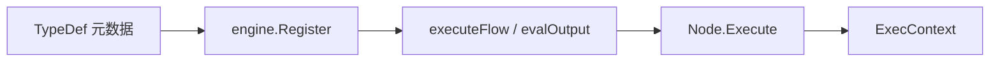

# 节点开发手册

本文说明如何为 OpsEngine **新增内置节点**（Go 实现 + 注册 + 可选前端定制）。

## 1. 开发模型概览

每个节点类型对应：

1. **一个 Go 包**：实现 `engine.Node` 接口；
2. **`init()` 注册**：`engine.Register(&Node{})`；
3. **`nodes.go` 聚合 import**：确保 `init` 被执行；
4. **（可选）前端组件**：在 `nodeTypeMap.ts` 登记自定义画布卡片。

**集合（Assemble）** 不是 Go 包，而是用户编辑的子图，运行时由引擎 `assemble:<id>` 特判 + `app.assembleToNodeType` 动态生成类型，**不在此手册范围**（见 [introduction.md](./introduction.md)）。



## 2. Node 接口契约

定义于 `internal/engine/node.go`：

```go
type Node interface {
    TypeDef() core.NodeTypeDef
    Execute(ctx ExecContext) (Outputs, error)
}
```

### 2.1 TypeDef 必填项

| 字段 | 说明 |
|------|------|
| `TypeID` | 全局唯一，如 `"my_ssh_exec"` |
| `DisplayName` | 画布/添加节点列表显示名 |
| `Category` | UI 分组（如 `debug`、`flow`、`remote`） |
| `NodeKind` | `event` / `action` / `pure` / `flow_control` |
| `InputPorts` / `OutputPorts` | 端口 ID、标签、`PortType`、`Required` |
| `ConfigSchema` | 驱动 `ConfigForm` 的字段定义 |
| `ExecutionMode` | `flow` / `remote_cmd` / `agent`（元数据，引擎当前按 NodeKind 调度） |

### 2.2 NodeKind 选型指南

| 需求 | 推荐 NodeKind | 端口 |
|------|---------------|------|
| 工作流/集合入口 | `event` | 仅 `exec_out` |
| 有副作用的步骤（写日志、调 API） | `action` | `exec_in` + `exec_out` + 数据口 |
| 纯计算/读配置/拼字符串 | `pure` | 仅数据 in/out |
| 多分支、并发、需引擎配合 | `flow_control` | 多 `exec_out_*`；往往需在 `evaluator.go` **增加特判** |

> `flow_control` 若仅靠 `Execute` 无法表达（如 `parallel` 开 goroutine），应参考 `parallel` / `thread`：TypeDef 在节点包，**执行逻辑在 `engine/parallel.go` 等**。

### 2.3 Execute 返回值

```go
type Outputs map[string]any  // key = output port ID
```

- **Action**：返回的 data 端口值会写入 `frame.Outputs[instanceID]`，供下游 `Input()` 读取。
- **纯 Exec 前进**：可 `return nil, nil`（如 `print` 只打日志）。
- **错误**：`return nil, err` → 节点 `Failed`，主流 abort（除非被 cancel）。

### 2.4 ExecContext API

| 方法 | 用途 |
|------|------|
| `Context()` | 监听取消 |
| `NodeID()` | 当前实例 ID |
| `Input(portID)` | 求值上游数据端口 |
| `Config` / `ConfigString` / `ConfigInt` / `ConfigBool` | 读实例 config |
| `GetVariable` / `SetVariable` | 当前 **frame** 作用域变量 |
| `GetParam` | 仅在集合子 frame 有效 |
| `Info` / `Warn` / `Error` | 写节点日志 → `execution:log` 事件 |

## 3. 手把手：新增一个 Action 节点

以仓库内 `print` 为参考（`internal/nodes/print/print.go`）。

### 3.1 创建包

```
internal/nodes/my_node/my_node.go
```

### 3.2 实现代码骨架

```go
package my_node

import (
    "OpsEngine/internal/core"
    "OpsEngine/internal/engine"
)

func init() { engine.Register(&Node{}) }

type Node struct{}

func (Node) TypeDef() core.NodeTypeDef {
    return core.NodeTypeDef{
        TypeID:      "my_node",
        DisplayName: "我的节点",
        Category:    "custom",
        NodeKind:    core.NodeKindAction,
        Icon:        "🔧",
        Description: "示例节点",
        InputPorts: []core.PortDef{
            {ID: "exec_in", Label: "▶", PortType: core.PortTypeExec, Required: true},
            {ID: "payload", Label: "数据", PortType: core.PortTypeString},
        },
        OutputPorts: []core.PortDef{
            {ID: "exec_out", Label: "▶", PortType: core.PortTypeExec},
            {ID: "result", Label: "结果", PortType: core.PortTypeString},
        },
        ConfigSchema: []core.FieldSchema{
            {Type: "text", ID: "api_url", Label: "API 地址", Required: true},
            {Type: "toggle", ID: "dry_run", Label: "试运行", Default: false},
        },
        ExecutionMode: core.ExecutionModeFlow,
    }
}

func (Node) Execute(ctx engine.ExecContext) (engine.Outputs, error) {
    if err := ctx.Context().Err(); err != nil {
        return nil, err
    }
    payload, _ := ctx.Input("payload")
    url := ctx.ConfigString("api_url")
    ctx.Info("调用 %s, payload=%v", url, payload)

    // ... 业务逻辑 ...

    return engine.Outputs{"result": "ok"}, nil
}
```

### 3.3 注册到聚合器

`internal/nodes/nodes.go` 增加：

```go
_ "OpsEngine/internal/nodes/my_node"
```

### 3.4 验证

```bash
go test ./internal/engine/...
make dev
```

在应用内：添加节点 → 应出现在列表 → 连线运行 → 查看日志与状态。

## 4. Pure 节点注意事项

- 不要依赖「只执行一次」；`evalOutput` **不缓存** pure 结果。
- 不要有必须靠 exec 流才能准备的副作用（应用 action 或把逻辑放在上游 action 输出里）。
- `assemble_param` 是 pure + `PortTypeDynamic` 的范例。

## 5. ConfigSchema 与前端表单

`core.FieldSchema` 字段（`internal/core/node.go`）：

| type | 说明 |
|------|------|
| `text` | 单行文本 |
| `password` | 密码 |
| `number` | 数字（可用 min/max） |
| `select` | 下拉，需 `options` |
| `toggle` | 布尔 |
| `textarea` | 多行（`print` 的 `default_text`） |

前端 `ConfigForm.tsx` 按 schema 渲染；未覆盖的 type 可能退化为原始 JSON 编辑（视实现而定）。

**config 存储**：`NodeInstance.Config map[string]any`，TOML 持久化；类型以 JSON 解码为准（数字常为 `float64`，`ConfigInt` 已做兼容）。

## 6. 端口命名约定

引擎校验与流控依赖约定，**请遵守**：

| 模式 | 用途 |
|------|------|
| `exec_in` / `exec_out` | 标准 action 单线 exec |
| `exec_out_<n>` | parallel 分支（`parallel.go` 扫描此前缀） |
| `exec_out_done` | parallel 汇合后主流出口 |
| `exec_out_continue` | thread 主流继续 |
| `exec_out_thread` | thread 后台分支 |
| `param_<name>` | 集合调用入参 |
| `return_<name>` | 集合调用返回值 |

新增 `flow_control` 若引入新 exec 端口名，须在 `evaluator.executeFlow` 增加分支，并更新 `validateExecOutSingle` 行为（凡 `exec_` 前缀的 from 端口均单出）。

## 7. 前端可选定制

### 7.1 默认：GenericNode

未在 `nodeTypeMap.ts` 登记的 `type_id` 使用 `generic: GenericNode`，根据 `NodeTypeDef` 自动画端口。

### 7.2 自定义画布组件

1. 在 `frontend/src/features/workflow/nodes/` 新建 `MyNode.tsx`（可基于 `BaseNode.tsx`）。
2. 在 `nodeTypeMap.ts` 注册：`[MY_NODE_TYPE]: MyNode`。
3. 在 `types/nodeType.ts` 增加常量（可选，便于引用）。

系统节点（`system_*`、`assemble_start/end`）因有固定布局单独实现。

### 7.3 执行态着色

`useNodeExecState(instanceId, framePath?)` 从 `ExecutionStore` 按当前查看的 frame 取 `NodeState`，无需改节点组件即可显示 Running/Success 等。

## 8. 引擎特判型节点（高级）

若节点行为无法写在 `Execute` 内（并发、子图、生命周期），需改引擎：

| 节点 | 引擎入口 |
|------|----------|
| `assemble:<id>` | `assemble.go` → `execAssembleCall` |
| `assemble_end` | `runAssembleEnd` |
| `parallel` | `parallel.go` → `runParallel` |
| `thread` | `thread.go` → `runThread` |
| `break` | `evaluator.go` 内联 cancel |
| `system_update` | `scheduler.go` |

新增此类能力前，建议先阅读 [architecture.md](./architecture.md) 第 3–6 节。

## 9. 测试建议

| 层级 | 做法 |
|------|------|
| 节点逻辑 | 表驱动测试 `Execute`，mock 最小 `ExecContext`（或抽 helper） |
| 引擎集成 | 在 `internal/engine/*_test.go` 建小图 JSON/TOML fixture，跑 `Run` |
| 手动 | `make dev`，画布连 print → 你的节点 |

引擎已有 `flow_test.go`、`lifecycle_test.go`、`assemble_test.go` 等，可作模板。

## 10. 检查清单

发布前确认：

- [ ] `TypeID` 唯一，已与 `registry` 无冲突
- [ ] `nodes.go` 已 import
- [ ] 端口 ID 与 `Execute` 中 `Input`/`Outputs` key 一致
- [ ] `NodeKind` 与端口结构匹配
- [ ] 保存画布时 `ValidateWorkflow` 能通过（exec 单出、input 单入）
- [ ] 长任务检查 `ctx.Context().Done()`
- [ ] 日志用 `ctx.Info/Warn/Error`，避免仅 `fmt.Println`
- [ ] 注释为中文（项目约定）

## 11. 相关文档

- [架构与调用分析](./architecture.md)
- [源码阅读说明](./source-reading.md)
