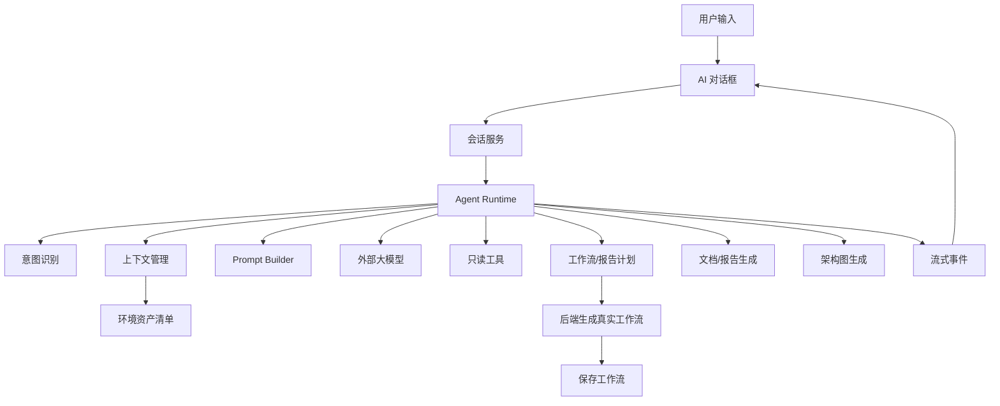
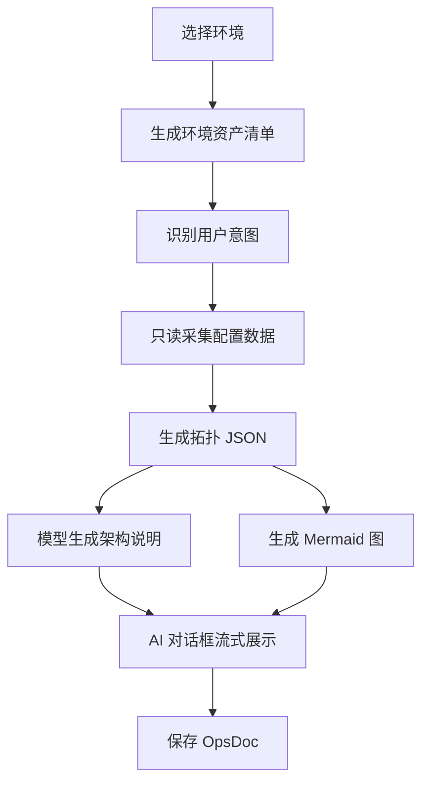

# OpsEngine 长期开发任务讨论稿

本文用于讨论 OpsEngine 后续长期演进方向，重点解决当前项目在 AI 助手、运维工作流生成、环境安全、上下文管理、执行可观测性上的问题。

本文不是一次性开发清单，而是一个可以持续修订的路线图。后续每个阶段都应该拆成独立需求、设计、实现和验收。

## 1. 当前定位

OpsEngine 当前已经不是单纯的工作流画布工具，而是在向“运维 Agent + 工作流执行平台”演进。

合理的产品定位应该是：

> 用户输入运维需求，选择目标环境，系统基于环境上下文、可用节点、历史会话和安全策略，生成可审查、可执行、可追踪的运维工作流，并能在执行后生成巡检、排障、架构分析等报告。

这意味着项目后续的核心能力不是“接一个大模型 API”，而是建设一套可控的运维 Agent Runtime。

## 2. 当前主要问题

### 2.1 AI 能力集中在 `ai.go`

当前 `ai.go` 同时承担：

- AI 设置读取与保存
- AI 会话 CRUD
- 用户意图判断
- 大模型调用
- SSH 服务器信息预取
- 对话 prompt 构造
- 工作流 prompt 构造
- 模型返回 JSON 解析
- 工作流 materialize
- Wails 事件推送

短期这样可以快速打通功能，但长期会导致：

- 新增巡检、排障、报告、架构解析时继续堆代码。
- Prompt、上下文、工具、安全策略无法独立演进。
- 单元测试困难，业务逻辑和 Wails 适配耦合过重。
- AI 失败原因难以定位，是 prompt 问题、模型问题、上下文问题还是工作流校验问题不清晰。

优化方向：

- `ai.go` 只保留 Wails RPC 入口和设置 CRUD。
- 新增 `internal/agent`，将运行时、意图、上下文、prompt、工作流生成拆开。
- 每个子模块都有明确输入输出，方便测试。

### 2.2 工作流生成方式不够稳定

当前方式是让模型直接输出接近最终工作流的 JSON，然后后端转换为 `core.WorkflowDef`。

问题：

- 模型容易编造节点类型、端口、配置字段。
- 画布位置、节点 ID、边关系都交给模型，稳定性不足。
- 复杂工作流越长，JSON 越容易出错。
- 后端只能做失败校验，不能很好地修正和补全。

优化方向：

- 将“模型直接生成工作流”改为“两阶段生成”。
- 第一阶段：模型输出运维计划，例如巡检目标、步骤、命令、报告结构。
- 第二阶段：后端根据节点目录、环境配置、安全规则生成真实工作流。

目标：

- 模型负责理解需求和规划步骤。
- 后端负责结构正确性、安全校验和工作流落库。

### 2.3 意图识别过于粗糙

当前通过关键词判断是否生成工作流：

- 命中“工作流 / 巡检 / 流程 / workflow / inspection / pipeline”就走 `generate_workflow`。
- 其他情况走普通对话。

问题：

- “帮我解释这个巡检报告”可能被误判为生成工作流。
- “不要生成工作流，只告诉我怎么排查”可能被误判。
- 后续加入排障、报告、架构解析后，关键词判断会越来越混乱。

优化方向：

- 建立 `Intent Router`。
- 第一阶段使用规则判断高置信场景。
- 第二阶段在不确定时调用 LLM 输出结构化 intent。

建议意图：

| 意图 | 说明 |
|---|---|
| `chat` | 普通运维问答 |
| `generate_workflow` | 生成工作流 |
| `inspect_server` | 执行或生成服务器巡检 |
| `troubleshoot` | 故障排查 |
| `generate_report` | 根据执行结果生成报告 |
| `analyze_architecture` | 解析服务器、容器、K8s 或应用架构 |

### 2.4 上下文没有长期管理机制

当前会话消息会直接拼入 LLM messages，SSH 快照作为隐藏 system message 保存。

问题：

- 长会话会无限增长，最终超过模型上下文窗口。
- 旧服务器快照可能过期，但模型仍当作真实状态。
- 历史工具结果可能污染当前问题。
- 用户偏好、已生成工作流、已排查结论没有结构化沉淀。

优化方向：

- 新增 `Context Manager`。
- 将上下文拆成多个 `ContextBlock`。
- 每个上下文块带类型、优先级、预算、时间戳。
- 长会话触发摘要压缩。
- 服务器快照带过期时间，可按需刷新。

建议上下文类型：

| 类型 | 内容 |
|---|---|
| `system` | 运维助手角色、安全边界、输出规范 |
| `environment` | 当前环境摘要，不包含密钥 |
| `server_snapshot` | SSH 只读采集结果 |
| `tool_catalog` | 可用工作流节点、配置 schema、端口信息 |
| `session_recent` | 最近几轮对话 |
| `session_summary` | 历史会话摘要 |
| `workflow_context` | 当前相关工作流、执行结果 |
| `user_memory` | 用户偏好和长期约束 |

### 2.5 Prompt 不可治理

当前 prompt 硬编码在 Go 字符串中。

问题：

- 修改 prompt 必须改代码。
- 不方便版本管理和人工评审。
- 不方便针对巡检、排障、报告做场景化模板。
- 无法沉淀 prompt 测试样例。

优化方向：

- 新增 `prompts/` 目录。
- 每类任务单独模板化。
- PromptBuilder 负责加载模板和注入上下文。

建议目录：

```text
prompts/
  system/
    ops_assistant.md
    safety.md
  intent/
    router.md
  workflow/
    inspection_plan.md
    troubleshooting_plan.md
  report/
    inspection_report.md
    troubleshooting_report.md
  architecture/
    server_architecture.md
```

### 2.6 环境和密钥安全需要分层

用户希望后续支持密钥分发、密钥连接和外部模型 API。

当前问题：

- AI 设置中的 API Key 直接本地保存。
- 环境配置与执行配置已经存在，但 AI 上下文注入必须严格避免泄露密钥。
- 模型只能看到必要的资产摘要，不能看到密码、私钥、Token。

优化方向：

- 配置层保存密钥，Agent 上下文层只暴露脱敏摘要。
- 密钥连接作为环境配置能力，不进入 prompt。
- 后续可接入系统密钥管理或用户自定义工作流分发密钥。

原则：

- 密钥可用于连接。
- 密钥不可被模型读取。
- 密钥不可被报告输出。
- 密钥不可被工作流草案明文保存，除非用户明确选择引用方式。

### 2.7 工具调用和执行权限还没有 Agent 化

OpsEngine 已有大量节点能力，例如 SSH、Docker、K8s、文件、脚本、日志等。

问题：

- 这些能力目前主要是工作流节点，还不是 Agent 可调用工具。
- 模型不能安全地边分析边调用只读工具。
- 写操作和危险操作没有统一权限协议。

优化方向：

- 建立 `Agent Tool Registry`。
- 节点能力可以映射为 Agent 工具，但先开放只读工具。
- 写入或破坏性动作必须走工作流审查。

权限分级：

| 级别 | 示例 | 策略 |
|---|---|---|
| 只读 | 查看系统信息、列目录、读日志、列容器 | 可由 Agent 自动调用 |
| 低风险写入 | 生成临时文件、保存报告 | 需要明确说明 |
| 高风险变更 | 重启服务、修改配置、发布镜像 | 生成工作流草案，用户确认后执行 |
| 禁止操作 | 删除根目录、格式化磁盘、泄露密钥 | 直接拒绝 |

### 2.8 巡检和报告能力还没有产品闭环

用户当前最先要做服务器巡检。

现有能力：

- 可以预取服务器基础信息。
- 可以生成工作流。
- 可以执行工作流。

缺口：

- 巡检项没有标准模板。
- 巡检结果没有结构化指标。
- 没有报告生成和风险分级。
- 没有历史巡检对比。

优化方向：

- 先建设 Linux 基础巡检模板。
- 巡检工作流输出结构化结果。
- 报告生成基于执行结果，而不是只靠模型自由发挥。

建议报告结构：

```text
1. 巡检概览
2. 资产信息
3. CPU / 内存 / 磁盘 / 网络
4. 进程和端口
5. Docker / K8s 状态
6. 风险项
7. 修复建议
8. 后续待确认问题
```

### 2.9 前端 AI 对话框需要承载 Agent 过程

当前前端已有多会话、流式消息、进度展示、工作流跳转。

后续问题：

- 进度事件类型还比较粗。
- 工具调用、上下文采集、报告生成、工作流校验没有统一展示。
- 生成工作流后缺少“解释为什么这样生成”的能力。
- 用户无法看到 Agent 当前处于哪个阶段。

优化方向：

- 事件协议增加 `phase` 和 `payload`。
- 对话框中展示：意图识别、上下文采集、工具调用、生成计划、保存工作流、生成报告。
- 工作流生成完成后在对话里给出摘要、风险提示和跳转按钮。

### 2.10 文档生成和架构图能力需要资产化

阅读 `claude-code-rev` 后可以提炼出两个可借鉴模式：

- `MagicDocs` 模式：识别带特殊头的 Markdown 文档，在会话空闲后用后台子 Agent 更新文档。
- `Insights` 模式：先聚合会话数据，再分段调用模型生成结构化分析，最后输出 HTML 报告。

这两个模式对 OpsEngine 的价值是：

- 巡检报告、排障报告、架构分析不应该只是一次性 AI 回复，而应该保存成可追踪的文档资产。
- 架构图不应该让模型凭空绘制，而应该基于进程、端口、容器、K8s workload、执行结果等结构化数据生成。
- 报告和架构图都应该能从 AI 对话框进入，也能从工作流执行结果进入。

建议能力：

| 能力 | 输入 | 输出 | 说明 |
|---|---|---|---|
| 巡检文档 | 工作流执行结果、服务器快照 | Markdown / HTML 报告 | 记录事实、风险项、建议 |
| 排障文档 | 故障现象、工具调用结果、执行日志 | Markdown / HTML 报告 | 区分事实、判断、结论 |
| 架构文档 | 进程、端口、容器、K8s workload | Markdown 架构说明 | 说明组件关系和入口 |
| 架构图 | 结构化拓扑 JSON | Mermaid 图 | 前端渲染为可视化架构图 |

建议引入 `OpsDoc` 概念：

```text
data/docs/
  <doc-id>.md
  <doc-id>.html
```

文档头可以参考：

```markdown
# OPS DOC: Linux 服务器巡检报告

_来源：工作流执行结果；更新策略：执行完成后刷新风险项和建议_
```

后续 Agent 只允许在指定文档范围内更新内容，不允许任意修改项目文件。

### 2.11 AI 会话应该从单配置绑定升级为环境级绑定

当前 AI 会话创建时必须选择环境中的某个 SSH 配置。这个设计适合“单台服务器巡检”，但不适合“整个环境分析”。

问题：

- 一个环境可能包含多个 SSH、Docker、K8s、Jenkins 配置。
- 用户想分析整个环境时，被迫先选一个 SSH，会让 Agent 视野变窄。
- 架构图、影响面分析、多服务器巡检都需要环境级上下文。
- 如果把会话绑定到单个 SSH，后续要跨配置分析时会出现上下文和权限边界混乱。

优化方向：

- 新建 AI 会话时只强制选择 `Environment`。
- `ConfigID` 改为可选，仅表示用户明确指定了某个配置作为当前分析范围。
- Agent 启动时先归纳环境内的配置清单，生成脱敏的 `Environment Inventory`。
- 当用户需求需要落到单个配置，但无法判断目标时，再由 Agent 追问用户。
- 只读分析可以自动遍历环境内多个配置；写操作仍必须生成工作流并由用户确认。

建议会话范围：

```go
type AISession struct {
    EnvironmentID string
    Scope         string // environment / config
    ConfigID      string // 可选；仅当用户指定单个配置时使用
}
```

Agent 可见的环境上下文必须是脱敏摘要：

```text
环境：生产环境
配置：
- SSH: web-01，主机地址已脱敏，用户 deploy，标签 web
- SSH: db-01，主机地址已脱敏，用户 root，标签 database
- Docker: web-01-docker，关联 web-01
- K8s: prod-cluster，namespace: default / ops
- Jenkins: prod-jenkins，地址已脱敏
```

安全边界：

- 密码、私钥、Token 不进入 prompt。
- 模型只知道有哪些资产，不知道密钥明文。
- Agent 工具执行时由后端使用真实配置连接。
- 高风险动作不允许由模型直接执行。

这一步是环境级架构图能力的前置条件。

## 3. 长期目标架构

目标后端结构：

```text
internal/agent/
  runtime/
    runtime.go
    events.go
    turn.go
  intent/
    router.go
  context/
    manager.go
    budget.go
    environment_inventory.go
    server_snapshot.go
  prompt/
    builder.go
    templates.go
  memory/
    compact.go
    store.go
  tools/
    registry.go
    permissions.go
  workflow/
    planner.go
    materializer.go
    validator.go
  report/
    inspection.go
    troubleshooting.go
  docs/
    store.go
    generator.go
    updater.go
  diagram/
    topology.go
    mermaid.go
```

目标调用链：



### 3.1 环境级架构分析实现链路

环境级架构分析不直接依赖模型自由发挥，而是按固定流水线执行：



关键数据结构：

```go
type EnvironmentInventory struct {
    EnvironmentID string
    EnvironmentName string
    Configs []EnvironmentConfigSummary
}

type EnvironmentConfigSummary struct {
    ID string
    Name string
    Kind string // ssh / docker / k8s / jenkins
    Labels []string
    SafeSummary map[string]string
}

type TopologyGraph struct {
    Nodes []TopologyNode
    Edges []TopologyEdge
    Evidence []TopologyEvidence
}
```

实现原则：

- `EnvironmentInventory` 只包含脱敏配置摘要。
- 真实连接参数只在工具执行层使用。
- `TopologyGraph` 是事实层，Mermaid 是展示层。
- 模型可以生成说明文字，但不能编造没有证据的节点和边。
- AI 对话框实时展示的是阶段进度、架构摘要和 Mermaid 预览。

## 4. 分阶段开发任务

### P0：稳定当前 AI 接入

目标：

- 保证 DeepSeek/OpenAI 兼容 API 能稳定配置、测试、调用。
- 明确 API Key 保存位置和脱敏策略。
- 保证 AI 对话框能稳定流式展示。

任务：

- 检查 AI 设置页保存、读取、测试流程。
- 增加模型连接失败的错误提示分类。
- 增加 API Key 脱敏显示。
- 明确本地模型无 API Key 的配置策略。

验收：

- 可配置 DeepSeek API Key 并测试成功。
- AI 对话可流式返回。
- 错误信息能区分配置错误、网络错误、模型响应错误。

### P1：拆出 Agent Runtime 骨架

目标：

- 不改变现有前端行为，先完成后端职责拆分。

任务：

- 新增 `internal/agent/runtime`。
- 新增 `internal/agent/intent`。
- 新增 `internal/agent/prompt`。
- `StartAIAssistant` 改为调用 runtime。
- 保持现有 chat 和 generate_workflow 能力不变。

验收：

- `go test ./...` 通过。
- AI 对话仍可流式。
- 工作流生成仍可保存和跳转。
- `ai.go` 明显变薄，只做入口适配。

### P1.5：AI 会话改为环境级范围

目标：

- AI 会话创建时只强制选择环境，不再强制选择某个 SSH 配置。
- 为后续环境级巡检、架构解析、多配置分析打基础。

任务：

- 调整 `AISession` 数据结构，保留 `EnvironmentID`，将 `ConfigID` 改为可选。
- 增加 `Scope` 字段，支持 `environment` 和 `config` 两种范围。
- 调整 `CreateAISession`，只校验环境是否存在。
- 前端新建 AI 会话只选择环境。
- 对话框展示当前环境范围，而不是固定展示某个 SSH 配置。
- 后端兼容旧会话：如果历史会话存在 `ConfigID`，自动视为 `config` 范围。

验收：

- 用户可以只选择环境创建 AI 会话。
- 环境下没有任何配置时，Agent 返回“请先配置环境”。
- 环境下有多个 SSH 配置时，Agent 可以先做配置清单归纳。
- 用户明确要求单台巡检但目标不清楚时，Agent 会追问要使用哪个配置。

### P2：Prompt 模板化

目标：

- 将硬编码 prompt 移出 Go 代码。

任务：

- 创建 `prompts/` 目录。
- 增加系统 prompt、工作流 prompt、意图识别 prompt。
- PromptBuilder 支持变量注入。
- 模板缺变量时返回清晰错误。

验收：

- 修改 prompt 不需要改 Go 代码。
- 工作流生成 prompt 可以单独评审。
- 单元测试覆盖模板加载和变量注入。

### P3：Intent Router

目标：

- 从关键词判断升级为规则 + LLM 分类。

任务：

- 定义 intent 枚举。
- 编写规则判断。
- 不确定场景调用 LLM 输出固定 JSON。
- 前端进度显示“正在判断需求类型”。

验收：

- “生成巡检工作流”进入工作流生成。
- “解释巡检报告”不误生成工作流。
- “排查服务器 CPU 高”进入排障意图。

### P4：Context Manager

目标：

- 统一管理环境、服务器快照、节点目录、会话历史。

任务：

- 定义 `ContextBlock`。
- 实现上下文预算和优先级裁剪。
- 实现 `Environment Inventory`，归纳环境下所有配置的脱敏摘要。
- SSH 快照增加时间戳和过期策略。
- 环境上下文脱敏。

验收：

- Prompt 不包含密码、私钥、Token。
- Prompt 包含环境级资产清单，而不是只包含单个 SSH 配置。
- 长会话不会无限拼接全部历史。
- 服务器快照过期后可刷新。

### P5：服务器巡检 MVP

目标：

- 先做用户最需要的服务器巡检。

任务：

- 定义 Linux 基础巡检计划。
- 支持从环境中选择或推断巡检目标 SSH。
- 生成单机巡检工作流。
- 执行后收集结构化结果。
- 生成巡检报告。

验收：

- 用户输入“帮我生成服务器巡检工作流”后，可以得到可执行工作流。
- 如果环境只有一个 SSH 配置，Agent 可直接使用该配置生成巡检工作流。
- 如果环境有多个 SSH 配置且用户未指定目标，Agent 先追问。
- 工作流执行后能生成巡检报告。
- 报告包含风险项和建议。

### P6：工作流两阶段生成

目标：

- 降低模型直接生成工作流 JSON 的不稳定性。

任务：

- 定义运维计划 JSON schema。
- LLM 只生成计划。
- 后端根据计划生成 `core.WorkflowDef`。
- 增加工作流草案解释。

验收：

- 模型不需要输出节点 ID 和连线细节。
- 后端生成的工作流校验通过率提升。
- 不合法计划能给出修正建议。

### P7：Agent 工具注册表

目标：

- 让 AI 能安全调用只读运维工具。

任务：

- 建立 Agent Tool schema。
- 将服务器快照、列目录、读日志、容器列表等映射为只读工具。
- 增加工具调用进度事件。
- 工具结果进入 Context Manager。

验收：

- 排障时 Agent 可以自动读取只读信息。
- 高风险操作不会被自动执行。
- 用户能在对话框看到工具调用过程。

### P8：排障和报告能力

目标：

- 从巡检扩展到故障排查。

任务：

- 定义 CPU 高、磁盘满、服务异常、容器异常等排障模板。
- 根据工具结果生成排查路径。
- 输出排查报告。

验收：

- 用户输入故障现象后，Agent 能生成排查步骤。
- 执行结果能沉淀为报告。
- 报告能区分事实、判断、建议。

### P9：架构解析能力

目标：

- 支持服务器、Docker、K8s、应用拓扑分析，并生成架构说明和架构图。

任务：

- 基于环境级会话读取完整 `Environment Inventory`。
- 采集端口、进程、容器、镜像、K8s workload。
- 生成结构化拓扑 JSON。
- 基于拓扑 JSON 生成架构摘要。
- 基于拓扑 JSON 生成 Mermaid 架构图。
- AI 对话框中实时展示架构图生成进度。
- 前端渲染 Mermaid 图，并支持查看原始拓扑数据。

验收：

- 用户可以要求“分析这个环境的服务架构”。
- 系统输出进程、端口、容器、依赖关系。
- 系统输出可渲染的 Mermaid 架构图。
- 支持导出架构分析报告。

### P10：文档和报告资产化

目标：

- 将 AI 生成的巡检报告、排障报告、架构分析沉淀为可保存、可更新、可导出的文档资产。

任务：

- 新增 `OpsDoc` 数据结构和本地存储。
- 支持 Markdown 文档保存。
- 支持 HTML 报告导出。
- 支持从工作流执行结果生成报告。
- 支持从架构拓扑生成架构文档和 Mermaid 图。
- 支持类似 `MagicDocs` 的受控更新机制：只更新指定文档，不任意修改其他文件。

验收：

- 巡检执行完成后自动生成巡检报告。
- 排障过程结束后可生成排障报告。
- 架构解析完成后可保存架构说明和架构图。
- 用户能从 AI 对话框、执行详情页、环境详情页进入相关文档。
- 文档更新基于最新事实，不保留过期结论。

## 5. 建议优先级

第一阶段先做：

1. P0 稳定 AI 接入
2. P1 拆 Agent Runtime
3. P1.5 AI 会话改为环境级范围
4. P2 Prompt 模板化
5. P3 Intent Router
6. P5 服务器巡检 MVP

原因：

- 用户当前最明确的业务目标是服务器巡检。
- 先拆 runtime，可以避免继续在 `ai.go` 上堆功能。
- 会话范围先升级到环境级，后续巡检、排障、架构图才不会被单个 SSH 配置限制。
- Prompt 和 intent 是后续所有 Agent 能力的基础。
- 巡检 MVP 可以最快形成可演示闭环。

暂缓：

- 复杂 MCP 外部工具接入。
- 自动执行高风险变更。
- 多模型路由。
- 企业级密钥管理。
- 完整架构可视化。
- 自动维护长期文档库。

这些能力有价值，但应在巡检闭环稳定后再做。

## 6. 需要继续讨论的问题

### 6.1 巡检范围

第一版巡检是否只做 Linux SSH，还是同时覆盖 Docker 和 K8s？

建议：

- 第一版只做 Linux SSH 基础巡检。
- Docker/K8s 如果当前环境配置存在，再作为附加巡检项。

### 6.1.1 AI 会话范围

AI 对话框是只选择环境，还是继续要求选择某个 SSH 配置？

建议：

- 新建 AI 会话只要求选择环境。
- `ConfigID` 保留为可选字段，用于用户明确指定单个配置时缩小范围。
- Agent 先整理环境下所有配置，再根据用户意图选择目标。
- 如果需要单配置操作但目标不明确，Agent 追问用户。

### 6.2 工作流是否自动执行

用户输入“帮我巡检服务器”时，是只生成工作流，还是生成后自动执行？

建议：

- 第一版默认只生成工作流。
- 执行必须用户点击确认。
- 后续可增加“可信只读巡检自动执行”开关。

### 6.3 报告来源

巡检报告是基于工作流执行结果生成，还是基于 AI 对话中的 SSH 快照生成？

建议：

- 正式报告必须基于工作流执行结果。
- 对话中的 SSH 快照只用于临时分析。

### 6.4 密钥分发方式

密钥是由 OpsEngine 保存，还是由用户工作流在执行前注入？

建议：

- 第一版继续使用本地环境配置保存连接信息。
- AI 上下文中只暴露脱敏摘要。
- 后续再做密钥引用和分发工作流。

### 6.5 是否引入 MCP

是否需要直接接 MCP 外部工具？

建议：

- 短期不优先。
- 先把 OpsEngine 内部节点能力封装成 Agent Tool。
- MCP 可作为后续外部工具扩展协议。

### 6.6 架构图格式

架构图第一版使用 Mermaid，还是直接做自定义拓扑画布？

建议：

- 第一版使用 Mermaid。
- 后端保存结构化拓扑 JSON。
- Mermaid 只是展示层产物，可以随时重新生成。
- 后续如果 Mermaid 表达能力不够，再做自定义拓扑画布。

### 6.7 文档导出格式

报告第一版只支持 Markdown，还是同时支持 HTML / PDF？

建议：

- 第一版保存 Markdown。
- 同时支持 HTML 预览。
- PDF 延后，等报告结构稳定后再做。

## 7. 成功标准

长期优化完成后，OpsEngine 应达到：

- 用户能通过自然语言描述运维需求。
- 系统能识别需求类型，而不是依赖前端功能选择。
- 用户必须先选择目标环境，但不必先选择单个 SSH 配置。
- Agent 能归纳环境下所有配置，并基于环境整体做分析。
- AI 不接触密钥明文。
- Agent 能采集只读上下文。
- 高风险操作必须生成工作流并由用户确认。
- 工作流生成稳定，不依赖模型拼接复杂节点 JSON。
- 巡检、排障、架构解析都能生成报告。
- 架构解析能生成基于真实拓扑数据的 Mermaid 架构图。
- 重要报告和架构分析能保存为可更新文档资产。
- 每次 AI 运行过程在前端可观察、可追踪、可复盘。
