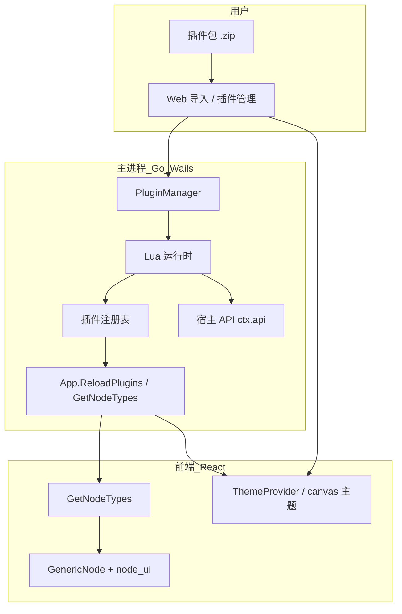
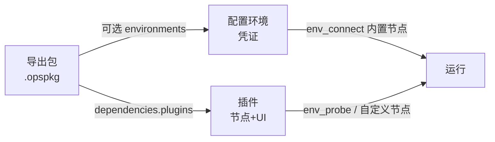

# 插件平台 — 实现草案与迭代规划

> **产品定位**：轻量、可定制程度高的运维编排桌面工具。  
> **核心不变**：执行引擎、画布框架、基础内置节点。  
> **生态扩展**：用户**不改主程序源码**，通过安装插件扩展节点能力、节点外观、连线样式与全局 UI。  
> 与 [architecture.md](./architecture.md)、[node-development.md](./node-development.md)、[environment-plan.md](./environment-plan.md) 配合阅读。

---

## 0. 总览

| 阶段 | 主题 | 状态 |
|------|------|------|
| P0 | 本文档 + manifest 契约冻结 | **进行中** |
| P1 | 插件目录、zip 导入、`ReloadPlugins`、Lua 加载、示例节点 | 待做 |
| P2 | `PluginNode` 注册进 `GetNodeTypes`；`node_ui`（L2a）；宿主 API v1（日志/HTTP） | 待做 |
| P3 | 宿主 API 扩展（mysql、ssh 封装、llm）；示例插件 mysql / llm | 待做 |
| P4 | `theme.json` + `canvas.json` 合并（L3/L4）；插件管理页 | 待做 |
| P5 | 权限声明、导出包 `dependencies.plugins` 校验 | 待做 |
| P6 | 可选前端 bundle 注册自定义节点组件（L2c） | 待做 |
| P7 | 可选 Go 子进程插件协议 | 待做 |

**与其它规划的关系：**

| 文档 | 关系 |
|------|------|
| [environment-plan.md](./environment-plan.md) | 凭证集中在环境；插件节点可调用 `ctx.api.environment.*`（后期） |
| [execution-ux-plan.md](./execution-ux-plan.md) | 执行 UI 独立演进；LLM 流式日志可增 `execution:llm_delta` |
| 工作流/集合导出导入（待单独立项） | 导出 manifest 声明 `dependencies.plugins` |

---

## 1. 产品原则

### 1.1 轻量

- **零插件可完整使用**：内置节点 + 默认主题 + TOML 持久化即可跑通工作流。
- **主安装包不膨胀**：重依赖（DB 驱动、各云 LLM SDK）由主进程**按需实现 API**，插件侧以 Lua 编排为主；避免每个插件各带一份驱动。
- **默认渲染路径简单**：绝大多数插件只提供 Lua + JSON（`node_ui` / `theme` / `canvas`），复用 `GenericNode` + `ConfigForm`。

### 1.2 可定制

用户通过 **插件包**（zip 或文件夹）可扩展：

| 层级 | 用户可定制 | 实现方式（摘要） |
|------|------------|------------------|
| **L1** | 新节点类型、端口、配置项、执行逻辑 | Lua `execute` + 宿主 `ctx.api` |
| **L2** | 节点卡片样式（图标、配色、布局参数） | manifest `node_ui` → GenericNode |
| **L3** | 连接线样式（颜色、线型、exec/data 区分） | manifest `canvas.edge` → React Flow |
| **L4** | 全局 UI（色板、按钮、侧栏、字体） | manifest `ui.theme` → CSS 变量 / ThemeProvider |

### 1.3 开放契约优先于语言

- **首选扩展语言**：**Lua**（进程内加载，导入/重载后**主进程不重启**、**无需编译**）。
- **进阶**：**Go 子进程插件**（自带 SDK、私有协议，需预编译 exe）。
- **关键**：统一的 **`manifest.json` + 宿主 API 版本**，而非绑定某一语言。

---

## 2. 架构



### 2.1 与内置节点的关系

| 来源 | 注册位置 | TypeID 示例 |
|------|----------|-------------|
| 内置 | `internal/nodes` `init()` → `engine.Register` | `linux_exec_command` |
| 集合 | `app.GetNodeTypes` 动态 `assemble:<uuid>` | `assemble:6d9df07e-...` |
| 插件 | `PluginManager` → 实现 `engine.Node` 的 `PluginNode` | `com.acme.mysql.connect` |

`engine.Lookup(typeID)` 统一查询：**内置 → 插件**（集合仍由引擎/assemble 特判，不占用 Register）。

**内置节点长期保留**（如 `linux_find_file`、`ssh_with_linux`）：运行时动态分析、临时连接等场景不强制迁到插件。

### 2.2 扩展边界

| 插件可以做 | 插件不做（保持核心稳定） |
|------------|-------------------------|
| 新 TypeID、新 PortType（需宿主先登记类型） | 替换执行引擎、Frame 模型 |
| 通过 API 调 SSH/DB/LLM/HTTP | 任意读写在未声明权限下的磁盘 |
| 覆盖主题 token、连线默认样式 | 替换整个 React Flow 或编辑器框架 |
| 可选注册自定义 React 节点组件（P6） | 未审核的任意远程脚本注入 |

---

## 3. 插件包规范

### 3.1 目录布局

```
plugins/<plugin_id>/
  manifest.json       # 必需
  nodes/
    *.lua             # L1：每个文件一个节点模块
  assets/
    icons/            # L2：SVG/PNG
    styles/           # L2b：scoped CSS（可选）
  theme.json          # L4：可合并进 manifest.ui
  canvas.json         # L3：可合并进 manifest.canvas
  frontend/           # L2c：可选，预构建 JS（P6）
    bundle.js
```

### 3.2 `manifest.json`（草案 v1）

```json
{
  "manifest_version": 1,
  "id": "com.example.mysql",
  "name": "MySQL 工具集",
  "version": "1.0.0",
  "description": "连接与查询 MySQL",
  "engine_min": "0.3.0",
  "language": "lua",
  "entry": "nodes",

  "permissions": ["network", "database"],

  "nodes": ["mysql_connect", "mysql_query"],

  "node_ui": {
    "com.example.mysql.connect": {
      "icon": "assets/icons/mysql.svg",
      "accent": "#00758f",
      "shape": "card"
    }
  },

  "ui": {
    "theme": {
      "primary": "#00758f",
      "radius": "0.375rem",
      "sidebarBg": "#0f172a"
    }
  },

  "canvas": {
    "edge": {
      "data": { "stroke": "#64748b", "strokeWidth": 2 },
      "exec": { "stroke": "#3b82f6", "strokeWidth": 2, "animated": false }
    }
  },

  "api_version": 1
}
```

| 字段 | 说明 |
|------|------|
| `manifest_version` | 契约版本，用于导入/迁移 |
| `id` | 全局唯一，建议反向域名 |
| `language` | `lua` \| `go`（P7） |
| `permissions` | 导入时展示给用户确认 |
| `nodes` | 对应 `nodes/<name>.lua` 模块名 |
| `node_ui` | 按 **完整 type_id** 配置 L2 |
| `ui` / `canvas` | L4 / L3，见 §5 |
| `engine_min` | 不兼容时拒绝加载并提示升级主程序 |

### 3.3 安装与热加载

```
用户：导入 zip → 解压到 data/plugins/<id>/
     → App.ImportPlugin / ReloadPlugins()
     → 扫描 manifest → 加载 Lua → 注册 TypeDef
     → 合并 ui/canvas 主题栈
     → 前端 invalidateQueries(['node-types', 'plugin-theme'])
```

| 要求 | 说明 |
|------|------|
| 主进程不重启 | Wails 应用持续运行 |
| 无需编译 | Lua + 资源文件即可（Go 插件除外） |
| 可禁用 | 插件管理里关闭后从注册表移除，不删文件 |
| 可卸载 | 删除目录 + Reload |

---

## 4. L1：节点能力（Lua）

### 4.1 节点模块约定

每个 `nodes/*.lua` 返回一张表：

```lua
return {
  type_id = "com.example.mysql.connect",  -- 全局唯一，建议带插件 id 前缀
  display_name = "MySQL 连接",
  category = "database",
  node_kind = "action",   -- event | action | pure | flow_control（慎用）
  icon = "🐬",
  description = "...",

  input_ports = {
    { id = "exec_in", port_type = "Exec", required = true },
  },
  output_ports = {
    { id = "exec_out", port_type = "Exec" },
    { id = "client", port_type = "MysqlConnection" },
  },

  config_schema = {
    { id = "host", type = "text", required = true },
    { id = "password", type = "password" },
  },

  execute = function(ctx)
    -- 见 §4.3
  end,
}
```

`flow_control` 插件节点 **MVP 不支持**（避免改 `evaluator` 特判）；仅 `action` / `pure` / `event`。

### 4.2 Go 侧 `PluginNode`

- 实现 `engine.Node`：`TypeDef()` 由 Lua 表生成 `core.NodeTypeDef`；`Execute()` 调用 Lua `execute(ctx)`。
- `ctx` 为 Go userdata，绑定 `ExecContext` 能力（§4.3）。
- 沙箱：禁用 Lua 原生 `io`/`os`/`package` 等，仅开放 `ctx` 与只读工具函数。

### 4.3 宿主 API（`ctx.api`，版本化）

**设计原则**：凡涉及网络、驱动、密钥的操作，均在 Go 实现；Lua 只做编排。

#### 4.3.1 基础（P2）

| API | 说明 |
|-----|------|
| `ctx.config(id)` / `config_int` / `config_bool` | 读节点配置 |
| `ctx.input(port_id)` | 数据端口求值 |
| `ctx.info` / `warn` / `error` | 执行日志 |
| `ctx.Context()` | 取消信号（内部） |

#### 4.3.2 连接与运维（P3+）

| API | 说明 | 新 PortType |
|-----|------|-------------|
| `ctx.api.mysql_connect(opts)` | MySQL 连接 | `MysqlConnection`（宿主登记一次） |
| `ctx.api.mysql_query(handle, sql, opts)` | 查询 | |
| `ctx.api.ssh_connect(opts)` | 与内置 SSH 对齐，可供插件复用 | 已有 `LinuxSshConnection` |
| `ctx.api.http_request(opts)` | 通用 HTTP（Webhook、简易 API） | |

#### 4.3.3 大模型（P3+）

| API | 说明 |
|-----|------|
| `ctx.api.llm_chat(opts)` | 非流式；`provider` / `model` / `messages` / `api_key` |
| `ctx.api.llm_chat_stream(opts, on_delta)` | 流式；`on_delta` 回调 → `ctx.info` 或专用事件 |

`provider` 由宿主实现：`openai`、`ollama`、`dashscope` 等；插件只选配置项。

#### 4.3.4 环境与探测（后期，对齐 environment-plan）

| API | 说明 |
|-----|------|
| `ctx.api.environment_get_config(env_id, config_id)` | 读环境凭证 |
| `ctx.api.probe_ssh_list_dir(...)` | 编辑态探测可由 `ProbeEnvNode` 统一入口，不一定暴露给 Lua |

#### 4.3.5 API 版本

- manifest `api_version` 与宿主 `PluginAPIVersion` 对齐。
- 不兼容时插件加载失败并给出明确错误（而非运行时 panic）。

### 4.4 新 PortType 的添加

插件引入新句柄类型（如 `MysqlConnection`）时：

1. 在 `internal/core/types.go` 增加 `PortType` 常量（**主程序一次性**）。
2. 前端 `nodeType.ts` 增加颜色与连线规则。
3. 插件 manifest 的 `port_type` 字符串与之一致。

**不等于**用户改源码；等于平台扩展「类型注册表」，频率应低。

---

## 5. L2 / L3 / L4：外观与画布

### 5.1 L2a — `node_ui`（推荐默认）

manifest 或 `node_ui.json` 片段：

```json
"com.example.mysql.connect": {
  "icon": "assets/icons/mysql.svg",
  "accent": "#00758f",
  "border": "2px solid #00758f",
  "minWidth": 180,
  "portLayout": "default"
}
```

`GenericNode` 读取 `nodeType.plugin_ui`（由 `GetNodeTypes` 下发）渲染，**无需**每个插件写 React。

### 5.2 L2b — 插件 CSS

- 路径：`assets/styles/plugin.css`
- 导入时挂载到 `document`，根选择器 `.plugin-<plugin_id>`，避免污染全局。

### 5.3 L2c — 自定义 React 组件（P6）

- manifest：`"components": { "com.example.mysql.connect": "frontend/bundle.js#MysqlNode" }`
- 前端插件加载器动态 `import()`；需 **信任确认** + 哈希校验。
- 仅面向深度定制；文档标注为维护成本高的路径。

### 5.4 L3 — 连接线 `canvas`

```json
"canvas": {
  "edge": {
    "default": { "type": "smoothstep", "stroke": "#94a3b8", "strokeWidth": 2 },
    "exec": { "stroke": "#3b82f6", "strokeWidth": 2 },
    "data": { "stroke": "#64748b" }
  },
  "connectionLine": { "stroke": "#3b82f6" }
}
```

`WorkflowCanvas` 使用 `useCanvasTheme()` 合并：**内置默认 < 插件按启用顺序覆盖**。

### 5.5 L4 — 全局 `ui.theme`

映射到 CSS 变量，例如：

```text
--ops-primary
--ops-sidebar-bg
--ops-button-radius
```

`ThemeProvider` 在 `ReloadPlugins` 后重新合并。支持「恢复默认主题」。

---

## 6. Lua 与 Go 插件对比（选型）

| 维度 | Lua（进程内） | Go（子进程） |
|------|---------------|--------------|
| 导入即生效 | 是 | 是（需包内带对应平台 exe） |
| 用户是否编译 | 否 | 是（除非分发预编译包） |
| 主进程重启 | 不需要 | 不需要 |
| 使用宿主 DB/LLM API | 自然 | 通过 RPC 调宿主 |
| 私有 SDK / 复杂依赖 | 受限 | 强 |
| 隔离性 | 沙箱依赖宿主实现 | 进程隔离更好 |
| 自定义 UI 组件 | 靠 manifest + GenericNode | 同左 |

**平台默认路径**：Lua + 宿主 API + manifest 外观。Go 子进程留给企业定制或官方「重插件」。

---

## 7. 安全与权限

| 项 | 策略 |
|----|------|
| 导入确认 | 展示 `permissions`，用户勾选「信任此插件」 |
| Lua 沙箱 | 无裸 `io/os`；网络/DB 仅 via `ctx.api` |
| 密钥 | 节点 `password` 字段；导出工作流时脱敏/警告 |
| CSS | 作用域前缀 + 可选禁用插件 CSS |
| JS bundle（P6） | 默认关闭；设置里开启「允许前端扩展」 |
| 审计 | 插件管理页记录启用/禁用/版本 |

---

## 8. 前端与 Wails API（规划）

| API | 说明 |
|-----|------|
| `ListPlugins()` | 已安装插件列表 + 状态 |
| `ImportPluginPackage(path or bytes)` | 解压安装 |
| `ReloadPlugins()` | 热加载 |
| `EnablePlugin(id)` / `DisablePlugin(id)` | |
| `UninstallPlugin(id)` | |
| `GetPluginThemes()` | 合并后的 ui/canvas（供 ThemeProvider） |

页面：

- 主页 Tab **「插件」** 或与「配置环境」并列：列表、导入、启用、日志。
- 设置：插件目录路径、是否允许 JS 扩展。

---

## 9. 后端模块划分（预估）

| 路径 | 职责 |
|------|------|
| `internal/plugin/manifest.go` | 解析与校验 manifest v1 |
| `internal/plugin/manager.go` | 安装、启用、Reload、合并主题 |
| `internal/plugin/lua/runtime.go` | gopher-lua 池、加载节点模块 |
| `internal/plugin/lua/node.go` | `PluginNode` 实现 `engine.Node` |
| `internal/plugin/lua/ctx.go` | userdata：`config`/`input`/`api` |
| `internal/plugin/api/v1/` | mysql、llm、http 等宿主 API 实现 |
| `internal/engine/registry.go` | 扩展 `Lookup` 查插件注册表 |
| `app.go` | Wails 绑定 |

前端：

| 路径 | 职责 |
|------|------|
| `frontend/src/features/plugin/PluginList.tsx` | 管理 UI |
| `frontend/src/features/plugin/PluginThemeProvider.tsx` | L3/L4 合并 |
| `frontend/src/api/plugins.ts` | hooks |
| `frontend/src/features/workflow/nodes/GenericNode.tsx` | 读 `plugin_ui` |

---

## 10. 示例插件（规划交付物）

| 插件 id | 目的 | 阶段 |
|---------|------|------|
| `opsengine.demo` | hello 节点 + 改主题色，验证端到端 | P1–P2 |
| `com.opsengine.mysql` | connect + query（API 示例） | P3 |
| `com.opsengine.llm` | prompt 节点 + ollama/openai provider | P3 |
| `com.opsengine.theme.dark` | 仅 L4/L3，无节点 | P4 |

---

## 11. 分阶段验收标准

### P1 — 加载器闭环

- [ ] `data/plugins/` 目录；`ImportPlugin` 解压 zip
- [ ] `ReloadPlugins` 后 `GetNodeTypes` 含插件 TypeID
- [ ] 示例 Lua 节点可在画布添加、保存 TOML
- [ ] 禁用插件后 TypeID 消失

### P2 — 可执行 + 基础 UI

- [ ] 插件 `execute` 可调 `ctx.info`；action 节点走通 exec 链
- [ ] `node_ui` 改变图标/强调色
- [ ] 导入后**不重启**主进程，添加节点列表立即更新

### P3 — 宿主 API 生态

- [ ] `MysqlConnection` + `mysql_connect` 示例插件
- [ ] `llm_chat` / `llm_chat_stream` + 示例插件
- [ ] API 版本不匹配时有清晰错误

### P4 — 画布与全局主题

- [ ] `canvas.json` 改变 exec/data 连线样式
- [ ] `ui.theme` 改变侧栏/按钮主色
- [ ] 多插件启用时合并顺序可配置

### P5 — 与导出、治理对齐

- [ ] 工作流/集合导出 manifest 含 `dependencies.plugins`
- [ ] 导入时缺失插件警告
- [ ] 权限声明与导入确认 UI

### P6 / P7 — 进阶

- [ ] 可选 JS 自定义节点组件
- [ ] Go 子进程插件协议草案 + 一个参考实现

---

## 12. 与「配置环境」「导出导入」的协同



- **环境**：官方/内置能力，管理 SSH/Docker 等凭证。
- **插件**：能力与市场扩展；可调用环境 API（后期）。
- **导出**：图资产迁移；校验插件是否已安装。

建议 **独立迭代**：插件 P1–P4 与 environment P1–P2 可并行；导出导入见后续 `export-import-plan.md`（待写）。

---

## 13. 风险与刻意不做的事

| 风险 | 缓解 |
|------|------|
| 插件质量参差 | 权限 + 信任确认 + 官方示例 |
| 主题/CSS 冲突 | 作用域 + 合并顺序 + 恢复默认 |
| API 泛滥 | 版本化、文档化；新 API 需评审 |
| Lua 性能 | 禁止重计算；大批量走 Go API |
| Windows 路径/编码 | 导入 zip 统一 UTF-8、规范路径 |

**刻意不做（保持轻量）**：

- 插件替换整个编辑器或执行引擎。
- 默认要求用户写 React 才能加节点。
- 支持无沙箱的任意远程脚本下载执行。
- MVP 即做插件市场付费体系（可后期）。

---

## 14. Agent / 迭代批次建议

| 批次 | 范围 | 预估依赖 |
|------|------|----------|
| A | P1 加载器 + demo 插件 + 插件管理页 MVP | 无 |
| B | P2 `node_ui` + GenericNode + 基础 ctx | A |
| C | P3 mysql + llm API 与示例插件 | B |
| D | P4 theme/canvas 合并 | B |
| E | P5 导出 dependencies + 权限 UI | 导出功能草案 + C |
| F | P6/P7 可选进阶 | D |

---

## 15. 参考

- 内置节点注册：`internal/engine/registry.go`、`internal/nodes/nodes.go`
- 节点契约：`internal/engine/node.go`、`docs/node-development.md`
- 动态集合类型：`app.go` `assembleToNodeType`
- 前端节点渲染：`frontend/src/features/workflow/nodes/GenericNode.tsx`
- Lua 实现选型：[gopher-lua](https://github.com/yuin/gopher-lua)（Go 进程内嵌入）

---

## 16. 文档维护

- 契约变更时递增 `manifest_version` / `api_version`，在本文件 **§0 总览** 更新阶段状态。
- 实现与文档冲突时以源码为准，并回写本节。
