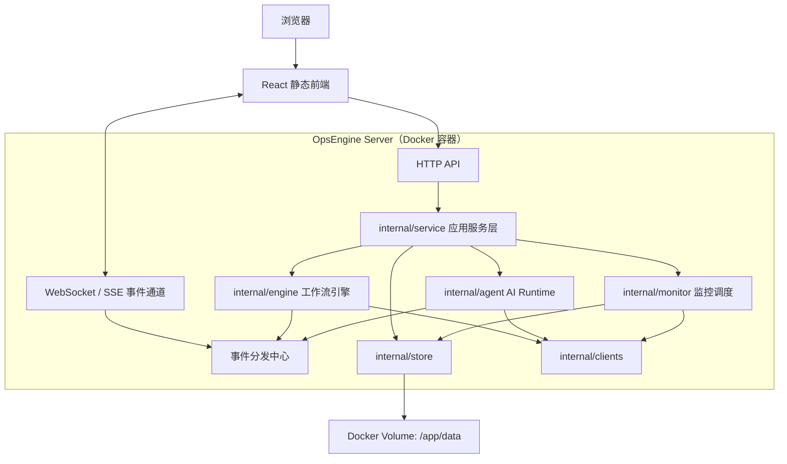
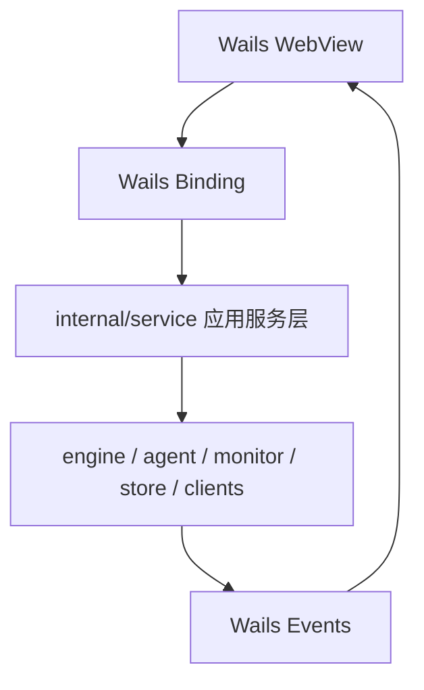

# OpsEngine Docker 与 Web 部署改造方案

## 1. 背景与结论

当前 OpsEngine 是 Wails 桌面应用，前端运行在桌面 WebView 中，通过 Wails Binding 调用 Go 后端方法，并通过 Wails Events 接收执行、AI、文件拖拽等运行时事件。

如果要支持 Docker 部署到服务器，并通过浏览器访问，不能直接把现有 Wails 程序放入容器后对外暴露。Wails Binding 依赖桌面运行时注入，不是标准 HTTP API。正确方向是保留现有桌面模式，同时新增 Web Server 模式，让两种入口复用同一套核心业务代码。

目标形态：

```text
桌面模式：Wails App + React WebView + 本地 Go Runtime
Web 模式：Go HTTP/WebSocket Server + React 静态前端 + Docker Volume
```

## 2. 当前架构边界

当前代码中真正可复用的核心能力主要集中在：

- `internal/core`：领域模型。
- `internal/store`：本地 TOML 存储。
- `internal/engine`：工作流执行引擎。
- `internal/nodes`：内置节点实现。
- `internal/agent`：AI Runtime、工具循环、报告生成、工作流生成。
- `internal/monitor`：监控采集、判断、调度、诊断报告。
- `internal/clients`：SSH、Docker、K8s、Jenkins、LLM 等客户端。

当前与 Wails 强绑定的外层主要是：

- `main.go`：Wails 启动入口。
- `app.go`：Wails 绑定方法与应用初始化混在一起。
- `ai.go`：AI Wails 方法入口。
- `monitor.go`：监控 Wails 方法入口。
- `ops_doc.go`：报告 Wails 方法入口。
- `frontend/src/api/*`：直接导入 `@wails/go/main/App`。
- 前端事件订阅：依赖 Wails runtime events。

因此改造重点不是重写核心逻辑，而是把外层通信方式从 Wails Binding 扩展为 HTTP API + WebSocket/SSE。

## 3. 目标架构



桌面模式继续保持：



关键原则：

- `internal/*` 核心能力不感知 Wails 或 HTTP。
- Wails 入口和 Web Server 入口只做协议适配。
- 前端业务组件不直接关心当前运行在 Wails 还是浏览器中。
- Docker 版默认以单管理员、单租户为第一阶段目标，不直接做复杂多租户。

## 4. 改造范围

### 4.1 新增服务层

建议新增：

```text
internal/service/
  app_context.go
  workflow_service.go
  assemble_service.go
  execution_service.go
  environment_service.go
  ai_service.go
  monitor_service.go
  ops_doc_service.go
```

服务层负责承载当前 `app.go`、`ai.go`、`monitor.go`、`ops_doc.go` 中真正的业务逻辑。Wails 方法与 HTTP Handler 都调用服务层。

示意：

```text
Wails App Method
  -> service.WorkflowService.CreateWorkflow

HTTP POST /api/workflows
  -> service.WorkflowService.CreateWorkflow
```

### 4.2 新增 Web Server 入口

建议新增：

```text
cmd/server/main.go
internal/server/
  router.go
  handlers_workflow.go
  handlers_environment.go
  handlers_ai.go
  handlers_monitor.go
  handlers_ops_doc.go
  websocket.go
  auth.go
```

`cmd/server/main.go` 负责初始化数据目录、store、engine、monitor scheduler、AI tool registry，启动 HTTP API，挂载前端静态文件，并启动 WebSocket/SSE 事件通道。

### 4.3 前端抽象通信层

当前前端 API 直接调用 Wails：

```ts
import { ListWorkflows } from '@wails/go/main/App';
```

建议改为 transport 抽象：

```text
frontend/src/lib/transport/
  index.ts
  wailsTransport.ts
  httpTransport.ts
  events.ts
```

业务 API 层只依赖统一函数或统一资源客户端。运行环境判断收敛在 transport 层：

- Wails 桌面环境：使用 `@wails/go/main/App`。
- 浏览器 Web 环境：使用 `fetch('/api/...')`。

### 4.4 实时事件通道

当前事件包括：

- `execution:started`
- `execution:status`
- `execution:node`
- `execution:log`
- `execution:variable`
- `execution:finished`
- `ai:assistant`
- `file:dropped`

Web 模式建议使用 WebSocket。第一版也可以用 SSE 承载只读事件，但 AI 工具确认、停止执行、交互控制后续会需要双向通信，因此更推荐 WebSocket。

建议新增统一事件模型：

```go
type EventEnvelope struct {
    Type string `json:"type"`
    Data any    `json:"data"`
}
```

Wails 模式走 `EventHub -> Wails EventsEmit`，Web 模式走 `EventHub -> WebSocket broadcast`。事件 payload 尽量复用现有 Wails event payload，降低前端改造成本。

### 4.5 数据目录与配置

Docker 版需要支持通过环境变量指定数据目录：

```text
OPSENGINE_DATA_DIR=/app/data
OPSENGINE_ADDR=:8080
```

容器挂载：

```yaml
volumes:
  - ./data:/app/data
```

保留现有数据结构：

```text
data/
  workflows/
  assembles/
  executions/
  environments/
  settings/
  ai-sessions/
  docs/
  monitor/
  logs/
```

### 4.6 Docker 构建

建议新增：

```text
Dockerfile
docker-compose.yml
.dockerignore
```

构建流程：

```text
1. frontend: npm ci && npm run build
2. backend: go build ./cmd/server
3. runtime: 复制 server 二进制、frontend/dist、必要配置
```

示例部署形态：

```yaml
services:
  opsengine:
    image: opsengine:server
    ports:
      - "8080:8080"
    environment:
      OPSENGINE_DATA_DIR: /app/data
      OPSENGINE_ADDR: :8080
    volumes:
      - ./data:/app/data
```

## 5. API 设计建议

第一版可以按资源划分 REST API：

```text
GET    /api/workflows
POST   /api/workflows
GET    /api/workflows/{id}
PUT    /api/workflows/{id}
DELETE /api/workflows/{id}

GET    /api/assembles
POST   /api/assembles
GET    /api/assembles/{id}
PUT    /api/assembles/{id}
DELETE /api/assembles/{id}

POST   /api/executions
POST   /api/executions/{id}/stop
GET    /api/executions
GET    /api/executions/{id}
DELETE /api/executions/{id}

GET    /api/environments
POST   /api/environments
GET    /api/environments/{id}
PUT    /api/environments/{id}
DELETE /api/environments/{id}

GET    /api/monitor/{environmentID}/overview
POST   /api/monitor/{environmentID}/tick
GET    /api/monitor/{environmentID}/config
PUT    /api/monitor/{environmentID}/config
POST   /api/monitor/panels/{id}/diagnosis

GET    /api/ai/sessions
POST   /api/ai/sessions
GET    /api/ai/sessions/{id}
POST   /api/ai/assistant

GET    /api/ops-docs
GET    /api/ops-docs/{id}
DELETE /api/ops-docs/{id}
```

WebSocket：

```text
GET /api/events
```

## 6. 安全要求

Web 部署后，OpsEngine 从个人桌面工具变成可被网络访问的运维控制面，安全边界必须升级。

第一阶段最低要求：

- 默认启用登录认证。
- 支持管理员账号初始化。
- 所有 API 和 WebSocket 都需要鉴权。
- 禁止无认证暴露到公网。
- 环境凭证不返回前端明文。
- 日志、AI prompt、工具结果中继续做敏感字段脱敏。
- Docker 版文档明确建议放在内网或 VPN 后。

第二阶段建议：

- 环境凭证加密落盘。
- 操作审计日志。
- AI 工具调用确认。
- `ssh_read_file`、Docker inspect、K8s secret 等高敏能力增加二次确认或默认禁用。
- WebSocket session 过期处理。
- CORS 白名单。
- CSRF 防护。

第三阶段再考虑：

- 多用户。
- 角色权限。
- 环境级权限隔离。
- 外部 SSO。

## 7. 实施路线

### Phase 1：服务层拆分

目标：不改变现有桌面功能，只把业务逻辑从 Wails 入口中抽出。

任务：

- 新增 `internal/service`。
- 将 workflow、assemble、execution、environment、ops doc、AI、monitor 的核心逻辑迁入 service。
- `app.go`、`ai.go`、`monitor.go`、`ops_doc.go` 改为薄适配层。
- 保持现有 Wails API 方法签名不变。

验收：

- `go test ./...` 通过。
- 桌面模式功能不回退。
- 前端无需大规模改动。

### Phase 2：Web Server 最小可用

目标：能在本机启动 HTTP Server，通过浏览器访问。

任务：

- 新增 `cmd/server/main.go`。
- 新增 HTTP Router 和核心 API。
- 挂载 `frontend/dist`。
- 支持 `OPSENGINE_DATA_DIR`。
- 提供基础健康检查接口。

验收：

- `go run ./cmd/server` 可启动。
- 浏览器能打开首页。
- 工作流、环境、监控概览基础 API 可用。

### Phase 3：前端 Transport 抽象

目标：同一套 React 组件可同时跑 Wails 和 Web。

任务：

- 新增 `frontend/src/lib/transport`。
- 将 `frontend/src/api/*` 从直接 Wails 调用改为统一 transport。
- Web 模式用 HTTP。
- Wails 模式仍用 Wails Binding。

验收：

- `npm run build` 通过。
- Wails 模式可用。
- Web Server 模式可用。

### Phase 4：实时事件 Web 化

目标：执行日志、AI 流式输出、监控状态刷新在 Web 模式下可用。

任务：

- 新增 EventHub。
- Wails 事件与 WebSocket 事件共用同一事件源。
- 前端事件订阅抽象为 `events.on(type, handler)`。
- execution 与 AI 事件先接入。

验收：

- Web 模式能实时显示工作流执行状态。
- Web 模式能显示 AI 流式响应。
- Wails 模式事件仍正常。

### Phase 5：Docker 化

目标：可通过 Docker Compose 部署单实例 OpsEngine Server。

任务：

- 新增 Dockerfile。
- 新增 docker-compose.yml。
- 支持数据卷挂载。
- 增加部署说明。

验收：

- `docker compose up` 后可访问 Web UI。
- 重启容器后数据仍保留。
- 监控后台调度可运行。

### Phase 6：安全加固

目标：让 Web 版具备最低可接受的运维控制面安全边界。

任务：

- 登录认证。
- API 鉴权。
- WebSocket 鉴权。
- 凭证脱敏返回。
- 高敏工具默认确认。
- 基础审计日志。

验收：

- 未登录不能访问 API。
- 未登录不能订阅事件。
- 前端不展示敏感凭证明文。
- 高风险读取能力有明确拦截或确认机制。

## 8. 关键风险

### 8.1 Wails 与 Web API 双入口重复

如果直接在 `app.go` 和 HTTP handler 中各写一套逻辑，会很快出现行为不一致。必须先抽 service 层。

### 8.2 实时事件语义漂移

前端执行态、AI 流式输出依赖事件顺序。EventHub 需要尽量复用现有 event type 和 payload，不要重新设计一套不兼容协议。

### 8.3 安全边界变化

桌面应用默认只有本机用户能操作；Web 服务可能被局域网甚至公网访问。Web 版不能在无认证状态下提供 SSH、Docker、K8s 操作入口。

### 8.4 数据并发

当前 TOML Store 适合单进程本地使用。Docker 单实例没有问题，但不适合多副本共享同一数据卷。第一版应明确只支持单实例部署。

### 8.5 文件路径与本地能力

Wails 的文件选择、文件拖拽、打开本地文件等桌面能力在 Web 模式下不可等价复用。Web 版需要改为上传文件、服务端路径选择或禁用部分桌面能力。

## 9. 不建议的方案

不建议直接把 Wails 桌面程序放到 Docker 中运行并通过远程桌面访问。这会带来体验差、部署复杂、安全边界模糊的问题。

不建议在前端组件里到处判断 `if wails else fetch`。运行环境差异应该收敛在 transport 层。

不建议第一阶段直接做多用户、多租户、复杂权限。先完成单管理员 Web 版闭环，再演进安全和权限模型。

## 10. 第一阶段最小成功标准

第一阶段完成后，应达到：

- 现有桌面应用功能不受影响。
- 业务逻辑已从 Wails 入口抽出到 `internal/service`。
- Web Server 可以启动并返回基础 API。
- 前端具备 Wails/Web 两种 transport 的切换能力。
- Docker 部署方案有清晰入口，但可以暂不覆盖全部实时能力。

这条路线的核心价值是：保留桌面版轻量体验，同时让 OpsEngine 具备服务器化部署能力，并为后续团队共享、远程访问、监控常驻运行打下基础。
